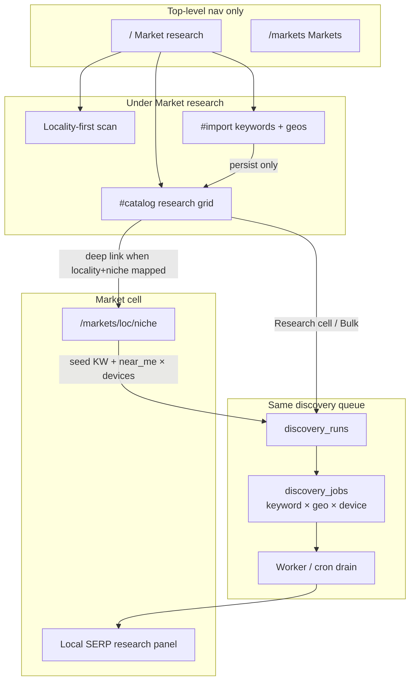

# Design: Bulk Market Research Import + Local SERP Analysis

| Field | Value |
|---|---|
| **Title** | Bulk Market Research — import-first niche×geo catalog, cell & bulk local SERP analysis |
| **Author** | Engineering |
| **Date** | 2026-08-04 |
| **Status** | Draft (rev 3 — market metrics grain, geo re-import, bulk budget default) |
| **Related** | `docs/reddit-serp-discovery.md`, Markets UI (`/markets/{locality}/{niche}`), discovery queue (`discovery_*`), DataForSEO organic live advanced, Google Ads keyword volume |

---

## Overview

Operators receive two operator-curated files: a **Google Ads Saved Keywords Stats** export (~1.2k keyword rows with national volumes) and a **home-service geographies** CSV (~200 markets with pre-resolved DataForSEO location codes and tier ranks). They need to **import and persist** that corpus **without spending money**, then **research local SERPs** for niche×geo cells — first one cell at a time, later in bulk — capturing more than Reddit alone: **organic, ads, local business profiles, discussions packs**, on **desktop and mobile**, plus a **cost-bounded long-tail** expansion under each seed term.

This design extends the existing Reddit discovery stack (`discovery_runs` / `discovery_jobs` / `reserveDiscoverySpend` / dual worker drain) rather than inventing a second product. **Top-level nav stays only Market research (`/`) and Markets (`/markets`)**. Import and research catalog live as sections under Market research (in-page anchors `#import` / `#catalog`); results also surface on market cells. Import never enqueues purchases. Spend only happens when the operator explicitly starts **cell research** or **bulk research**, after a dry-run cost estimate and budget cap.

---

## Background & Motivation

### Current product model

| Concept | Implementation |
|---|---|
| Market cell | Locality + niche → `/markets/{localitySlug}/{nicheSlug}` |
| Locality-first scan | Home `/` → `scan_runs` → `runScan` scores all active seed niches for one place |
| Seed niches | ~40 curated rows in `packages/data/src/seed/niches.ts` (`niches` table) |
| Reddit discovery | `discovery_*` tables; `enqueueMarketDiscovery` (2 keywords × 1 geo); bulk CSV enqueue via `enqueueDiscoveryRun` |
| Extraction | `@rnr/core` `extractRedditHitsFromDfsResult` over raw DFS items |
| Scoring path | `normaliseOrganicResult` — **organic-only, load-bearing**; must stay untouched for difficulty/CTR |
| Budget | Discovery: DB-atomic `reserveDiscoverySpend`; Scan: process-local `BudgetGuard` on `scan_runs` |
| Worker | voice → SERP monitor → discovery → scan (`main.ts`); cron `drainQueues` also drains discovery |
| Fixtures | `LIVE_CALLS_ENABLED !== 'true'` → zero-cost synthetic paths; `used_fixtures` sticky on run |

### What already works (reuse)

- Discovery job queue: `FOR UPDATE SKIP LOCKED` on `discovery_jobs` (`packages/data/src/serp/run-discovery.ts`)
- Atomic spend: `packages/data/src/serp/discovery-budget.ts` — **not** `BudgetGuard`
- Geo resolve (name/state path): `resolveDiscoveryGeos` — **must be extended** for CSV location codes without locality (see [Purchasable geo](#purchasable-geo-predicate))
- CSV parsers: `parseDiscoveryNicheCsv` / `parseDiscoveryGeoCsv` (`packages/core/src/serp/discovery-csv.ts`) — **insufficient** for Google Ads meta lines / home-service code columns
- Market cell Reddit panel: `MarketRedditPanel` + `enqueueMarketRedditAction` (2 SERPs, desktop only today)
- Cell queries: `listDiscoveryHitsForCell`, `listDiscoveryRunsForLocality` in `discovery-queries.ts` — latter is **locality-only** and must be tightened (see [Market cell data binding](#market-cell-data-binding))
- Google Ads volume API (promote path only): `packages/data/src/providers/google-ads/keyword-volume.ts`
- DFS detailed organic: `fetchOrganicSerpDetailed` + `Providers.fetchOrganicSerpDetailed(ctx, opts?)` — **opts today only `{ depth? }`**; desktop hard-coded in live POST body
- Fixture seed: `discovery:${keyword}:${locationCode}` in `fixtureOrganicSerpDetailed` — **device not in seed**
- Prices: `PRICE.serpOrganicLive = $0.002`, `PRICE.serpMapsLive = $0.002` (`packages/core/src/money.ts`)

### Pain points this request fixes

1. **Import = spend today.** `enqueueDiscoveryRun` inserts niches/geos **and** all SERP jobs in one transaction.
2. **Reddit-only extract.** Need ads / local pack / above-first-organic metrics.
3. **Desktop-only purchases** end-to-end (serp.ts, Providers, fixtures, runner).
4. **Google Ads Saved Keywords Stats** shape differs from discovery niche CSV.
5. **Home-service geo CSV** has `dataforseo_location_code` — re-resolve-by-name is wrong; current path also **requires `localityId`** for jobs.
6. **No tiered bulk** with cap-compatible defaults.
7. **Nav/product feel** — stay under Market research / Markets.

### Cost envelope

Unit: organic live advanced = **$0.002** per keyword × location × device.

**Job count formula (normative):**

```
jobCount = |keywords| × (includeNearMe ? 2 : 1) × |purchasableGeos| × |devices|
estimatedCostLiveMicros = jobCount × PRICE.serpOrganicLive   // 2000n
estimatedCostFixturesMicros = 0n                              // research preview always
maxLiveSpendUnderHardCap = 5000 × $0.002 = $10.00             // true ceiling if budgetCap ≥ $10
```

| Scenario | Jobs | Est. live cost |
|---|---|---|
| Market cell (seed primary + near_me × 1 geo × 2 devices) | 4 | **$0.008** |
| Market cell today (2 KW × 1 device, legacy) | 2 | **$0.004** |
| **Default bulk (cap-compatible)** — Top 50 KW by volume × Top 50 geos × 2 devices, near_me off | **5,000** | **$10.00** |
| Top 50 KW × Top 50 geos × 1 device | 2,500 | **$5.00** |
| 20 catalog primaries × 50 geos × 2 devices | 2,000 | **$4.00** |
| All primaries (~600) × 50 geos × 2 devices | ~60,000 | **$120** → **rejected** at hard cap 5,000 |
| 200 geos × 40 seed niches × 2 KW × 2 devices | 32,000 | **$64** → reject unless narrowed |
| Naïve 1,276 KW rows × 200 geos × 2 devices | 510,400 | **$1,020.80** → reject |

**MVP hard rules:**

1. Hard cap **`DEFAULT_MAX_JOBS = 5000`** per research run → **max live spend $10.00** if budget cap allows.
2. **Bulk defaults are always ≤ hard cap** (Top 50 keywords by `avg_monthly_searches` among active primaries × Top 50 geos × both devices, `includeNearMe = false` → exactly 5,000 when both tiers full).
3. If operator selection still exceeds cap: **auto-rank-and-cut** keywords by volume (then geos by `selected_rank`) until `jobCount ≤ hardCap`, with preview line `truncated keywords 600 → 50 to fit hard cap 5000`.
4. Dry-run always shown before confirm. Reject only if still over after truncate is disabled by operator (advanced “strict selection” mode — default is auto-truncate on).
5. Budget cap reject when live `estimatedCostMicros > budgetCapMicros` (fixtures never require a real dollar cap).

---

## Goals & Non-Goals

### Goals

1. **Import-first corpus** for Google Ads keyword stats TSV + home-service geographies CSV; persist without purchasing SERPs.
2. **Cell = imported keyword seed × imported geo** (optional soft-map to seed `niches` / `localities`); research without requiring locality match when DFS code present.
3. **One-by-one research** and **bulk research** on the **same** discovery job queue + `reserveDiscoverySpend` model.
4. **Extended SERP analysis** (per device) with frozen counting rules (appendix).
5. **Desktop and mobile** SERPs via Providers + fixture seed + runner (two jobs).
6. **Long-tail MVP** = related searches from purchased SERP (cap 8; not auto-researched).
7. **Dry-run**, cap-compatible defaults, auto-truncate, hard job caps.
8. **UI**: import + catalog under Market research; dual-device metrics + absolute Reddit rank on market cells; **no new top-level nav**.
9. Preserve **`normaliseOrganicResult` organic-only** forever.
10. Fixture mode, ledger reconciliation, dual drain, cancel/budget_exceeded parity.

### Non-Goals

- Auto-inserting orphan rows into seed `niches` from Google Ads keywords.
- Replacing locality-first scan scoring, rent priors, or EMD modelling.
- Separate Maps live purchase for every cell in MVP.
- Unbounded keyword ideation APIs at corpus scale.
- Changing top-level nav; resurrecting `/research/reddit` as a branded surface.
- Writing raw multi-type items into `serp_snapshots` under `se_type = 'organic'`.
- Auto-promote / auto-create sites from bulk research.
- Real-time streaming research UX or multi-tenant RBAC.

---

## Proposed Design

### Integration philosophy

```
Import (free)          Research (paid)              Operate (existing)
─────────────          ───────────────              ─────────────────
catalog_keywords  ──►  discovery_jobs (serp)  ──►  market cell UI
catalog_geos      ──►  discovery_serp_metrics     promote → serp_* monitor
catalog cells          discovery_hits (Reddit)
                       related_searches (long-tail)
```



### End-to-end sequence

```mermaid
sequenceDiagram
  participant Op as Operator
  participant UI as Web UI
  participant DB as Postgres
  participant W as Worker
  participant DFS as DataForSEO

  Op->>UI: Upload Keywords Stats TSV + geos CSV
  UI->>DB: Parse pure; upsert research_keywords / research_geos
  Note over UI,DB: No discovery_jobs. Spend = $0.

  Op->>UI: Dry-run (defaults ≤ 5k jobs)
  UI->>DB: Preview jobCount, truncate note, estimatedCost
  Op->>UI: Confirm research (budget cap; worker warning if live & jobs>50)
  UI->>DB: INSERT discovery_runs + pending jobs for selected cells

  loop claim job FOR UPDATE SKIP LOCKED
    W->>DB: reserveDiscoverySpend(cost or 0n fixtures)
    alt reserved
      W->>DFS: organic live advanced depth=job.depth device=job.device os=job.os
      DFS-->>W: raw items
      W->>W: extract metrics + Reddit + related_searches
      W->>DB: discovery_serp_metrics, hits, raw_items
    else budget exceeded
      W->>DB: skip remaining; run budget_exceeded
    end
  end
```

---

## Key Decisions

| # | Decision | Rationale |
|---|---|---|
| K1 | **Persistent research catalog** tables separate from `discovery_runs` | Import-first; run-scoped niches/geos couple import to enqueue |
| K2 | **Reuse `discovery_runs` / `discovery_jobs` / `reserveDiscoverySpend`** | Concurrent-safe budget, dual drain, redrive, cancel |
| K3 | **One SERP job = one (keyword, geo, device)** | Clear cost unit; dual-device = two jobs |
| K4 | **MVP analysis uses organic live advanced only** | Ads/local_pack/related/discussions in one purchase; Maps doubles cost |
| K5 | **Never poison `normaliseOrganicResult` / organic `serp_snapshots`** | Difficulty scoring depends on organic-only rank_group |
| K6 | **Long-tail MVP = related_searches cap 8, no auto-enqueue** | Zero marginal cost; UI labels “not auto-researched” |
| K7 | **Google Ads TSV → catalog keywords, not auto-`niches` inserts** | Soft-map only; promote still needs mapped `niche_id` |
| K8 | **Purchasable geo iff numeric location code; `locality_id` optional** | CSV pre-resolved codes work without soft-match; deep-links optional |
| K9 | **Bulk defaults: Top 50 KW by volume × Top 50 geos × both devices, near_me off** | Exactly at hard cap 5k / **$10 max**; auto-truncate if over |
| K10 | **Near-me pairing at import; bulk default near_me off** | Reduces fan-out; cell research still includes near_me by default |
| K11 | **UI: catalog under Market research; cell panel on Markets; anchors only** | Two-link nav preserved |
| K12 | **Fixtures: costMicros = 0n; used_fixtures sticky; research preview estimate = 0n** | Intentional preview behavior change vs legacy discovery preview |
| K13 | **Market cell button = seed `keywordNoun` + synthesised near_me × devices** | Parity with `enqueueMarketDiscovery`; catalog uses catalog keywords |
| K14 | **Local pack count MVP = 1 per pack container** (not nested GBP fan-out) | Matches existing contracts without nested elements; re-extract after canary |
| K15 | **`RESEARCH_BULK_ENABLED` default false until live canary** | Cell research can ship earlier under fixtures/live small runs |
| K16 | **Market panel primary cards = `source=market_cell` + `keyword_variant=primary` per device** | Avoids mixing near_me / catalog into dual-device cards; near_me secondary; catalog is separate section |
| K17 | **Bulk live `budgetCapCents` default = preview estimate (min 1000 for full default grid)** | Operator does not bounce on missing/too-low cap for the $10 default bulk |

---

## Data Model Changes

### New: research catalog (import-only)

#### `research_keyword_imports`

| Column | Type | Notes |
|---|---|---|
| `id` | serial PK | |
| `source_filename` | text | |
| `source_kind` | text | `google_ads_saved_keywords` \| `discovery_niche_csv` |
| `row_count` / `skipped_count` | int | |
| `date_range_raw` | text null | Second meta line from Google export |
| `created_at` | timestamptz | |

#### `research_keywords`

| Column | Type | Notes |
|---|---|---|
| `id` | serial PK | |
| `import_id` | FK → research_keyword_imports | Last import that wrote this row |
| `keyword` | text | Verbatim |
| `keyword_norm` | text | `lower(trim(keyword))` |
| `seed_key` | text | Strip trailing ` near me` (case-insensitive) |
| `variant` | text | `primary` \| `near_me` \| `other` |
| `avg_monthly_searches` | double precision null | **null ≠ 0** |
| `competition` | text null | |
| `competition_index` | double precision null | |
| `top_of_page_bid_low_micros` | bigint null | Parsed to micros when possible |
| `top_of_page_bid_high_micros` | bigint null | |
| `top_of_page_bid_raw` | text null | Optional raw export cell if parse fails |
| `in_account` | text null | |
| `monthly_series` | jsonb null | Jul 2025…Jun 2026 etc. |
| `niche_id` | int null FK → niches | Soft-match |
| `active` | boolean not null default true | |
| `line_number` | int null | |
| `created_at` / `updated_at` | timestamptz | |

**Unique:** `keyword_norm` (global active corpus).

**Re-import (normative):**

```sql
INSERT ... ON CONFLICT (keyword_norm) DO UPDATE SET
  keyword = EXCLUDED.keyword,
  avg_monthly_searches = EXCLUDED.avg_monthly_searches,
  -- ... metrics columns ...
  import_id = EXCLUDED.import_id,
  active = true,
  updated_at = now();
-- After successful import of file F:
UPDATE research_keywords SET active = false
 WHERE import_id IS DISTINCT FROM $newImportId
   AND keyword_norm NOT IN (SELECT keyword_norm FROM rows_in_this_import);
```

Rows missing from the new file are **deactivated** (`active = false`), not hard-deleted (preserves FK history on jobs).

#### `research_geo_imports`

| Column | Type | Notes |
|---|---|---|
| `id` | serial PK | |
| `source_filename` | text | |
| `source_kind` | text | `home_service_geographies` \| `discovery_geo_csv` |
| `row_count` / `skipped_count` | int | |
| `created_at` | | |

#### `research_geos`

| Column | Type | Notes |
|---|---|---|
| `id` | serial PK | |
| `import_id` | FK | |
| `market` | text | Display name |
| `state` | text null | Full name if present |
| `state_abbr` | text null | Prefer for matching |
| `population_2025` | int null | |
| `selected_rank` | int null | Lower = higher priority for Top N |
| `test_tier` | text null | Free-text; Top 50 helper uses `selected_rank <= 50` **or** tier tokens |
| `dataforseo_location_code` | int null | **Authoritative when present** |
| `dataforseo_location_name` | text null | |
| `dataforseo_location_type` | text null | |
| `natural_query_modifier` | text null | |
| `disambiguated_query_modifier` | text null | |
| `recommended_explicit_modifier` | text null | |
| `extra` | jsonb null | reddit_* and other pass-through |
| `locality_id` | int null FK → localities | Soft-link only |
| `location_source` | text null | `csv_preresolved` \| `dataforseo` \| `google_geotargets` |
| `resolve_status` | text | `resolved` \| `unresolved` \| `unscannable_source` |
| `unmatched_reason` | text null | |
| `active` | boolean | |
| `line_number` | int null | |
| `created_at` / `updated_at` | | |

**Unique (normative upsert keys):**

1. When `dataforseo_location_code IS NOT NULL`: unique on that code (partial unique index).
2. Else: unique on `(lower(market), lower(coalesce(state_abbr, state, '')))` via db-extras if needed.

**Re-import (mirror keywords — normative):**

```sql
-- Prefer code path when present:
INSERT ... ON CONFLICT (dataforseo_location_code) WHERE dataforseo_location_code IS NOT NULL
  DO UPDATE SET
    market = EXCLUDED.market,
    state = EXCLUDED.state,
    state_abbr = EXCLUDED.state_abbr,
    population_2025 = EXCLUDED.population_2025,
    selected_rank = EXCLUDED.selected_rank,
    test_tier = EXCLUDED.test_tier,
    -- modifiers, locality soft-link refresh, resolve_status, location_source ...
    import_id = EXCLUDED.import_id,
    active = true,
    updated_at = now();

-- Rows without a code: ON CONFLICT on (lower(market), state key) DO UPDATE same pattern.

-- After successful import of file F:
UPDATE research_geos SET active = false
 WHERE import_id IS DISTINCT FROM $newImportId
   AND id NOT IN (SELECT id FROM geos_upserted_in_this_import);
```

Never hard-delete geos (preserve `research_geo_id` / job history FKs). Deactivated geos are excluded from default bulk selection and catalog “active” filters; historical metrics remain queryable by id.

### Purchasable geo predicate

**Normative (replaces today’s “resolved AND localityId not null” for catalog research):**

```
purchasable(geo) ⇔
  geo has numeric location_code
  AND (fixtures OR location_source ∈ {csv_preresolved, dataforseo})
```

| Case | resolve_status | locality_id | Jobs? | Market deep-link? |
|---|---|---|---|---|
| CSV code present, locality soft-matched | `resolved` | set | **Yes** | Yes |
| CSV code present, **no** locality match | `resolved` | **null** | **Yes** | No (catalog-only results) |
| No code, locality with dataforseo code | `resolved` | set | Yes | Yes |
| No code, locality google_geotargets only, live | `unscannable_source` | maybe | **No** | N/A |
| No code, no locality | `unresolved` | null | **No** | No |

**Import resolve rules:**

1. If `dataforseo_location_code` present → `resolve_status = 'resolved'`, `location_source = 'csv_preresolved'`, **do not** re-resolve by name for purchasability.
2. Soft-match `localities` by `provider_location_code` first, then name+state — **optional** for deep-links only.
3. Never widen codes.

### Cell status without full materialisation

Do **not** pre-materialise keyword×geo at import. Derive status when listing a selection:

| Status | Definition |
|---|---|
| `idle` | No jobs for this (seed keyword set × geo × requested devices) in last N days (or ever) |
| `queued` | ≥1 pending/claimed job, 0 done for this cell in active run |
| `partial` | Under the **binding grain** for that surface (market: primary×device; catalog: selected keyword×device), ≥1 requested slot done and ≥1 still pending/missing |
| `done` | All requested **grain slots** have a latest successful metrics row (market MVP: primary desktop + primary mobile when both devices requested) |
| `failed` | Latest attempt finished with all jobs failed/skipped and no successful metrics for the grain |

Optional later: `research_cells` denorm table — **not MVP**.

### Extend discovery for catalog + devices + metrics

#### `discovery_runs` additions

| Column | Type | Notes |
|---|---|---|
| `source` | text not null default `legacy_csv` | `legacy_csv` \| `catalog` \| `market_cell` |
| `devices` | text not null default `desktop` | Snapshot string: `desktop`, `mobile`, or `desktop,mobile` (**not** text[]) |
| `include_near_me` | boolean not null default true | |
| `geo_tier_filter` | text null | e.g. `top_50` |
| `estimated_cost_micros` | bigint null | Snapshot from dry-run (`0n` when fixtures) |
| `selection_note` | text null | e.g. `truncated keywords 600 → 50 to fit hard cap` |

#### `discovery_jobs` additions

| Column | Type | Notes |
|---|---|---|
| `device` | text not null default `desktop` | `desktop` \| `mobile` |
| `os` | text not null default `windows` | desktop→`windows`; mobile→`android` |
| `research_keyword_id` | int null FK | Catalog identity (null for pure market_cell seed path) |
| `research_geo_id` | int null FK | |
| `depth` | int not null default **10** | Job row wins over function defaults |

**Run-scoped snapshots:** catalog enqueues still insert `discovery_niches` / `discovery_geos` rows for the run (keeps existing joins) **and** set catalog FKs on jobs. Snapshot geos copy `provider_location_code` from catalog even when `locality_id` is null.

**Schema change on jobs:** `locality_id` remains nullable (already is). Enqueue **must allow** null locality when code present — **change** from current fan-out that skips `localityId === null`.

#### `discovery_serp_metrics` (one row per completed SERP job)

| Column | Type | Notes |
|---|---|---|
| `id` | serial PK | |
| `job_id` | int unique FK → discovery_jobs | |
| `run_id` | FK | |
| `locality_id` | int null | |
| `niche_id` | int null | Denorm for market-cell queries |
| `research_keyword_id` / `research_geo_id` | int null | |
| `keyword` | text | Verbatim purchased |
| `device` | text | |
| `os` | text | |
| `location_code` | int | |
| `first_organic_rank_absolute` | int null | |
| `ads_above_organic_count` | int not null default 0 | |
| `local_profiles_above_organic_count` | int not null default 0 | |
| `organic_count` / `paid_count` / `local_pack_count` | int | |
| `discussions_pack_present` | boolean | |
| `reddit_hit_count` | int | |
| `related_searches` | jsonb | `string[]` max 8 |
| `item_types` | jsonb | audit |
| `measured_at` / `created_at` | timestamptz | |

Indexes: `(locality_id, niche_id, device, measured_at desc)`, `(research_keyword_id, research_geo_id, device)`.

#### `discovery_hits`

Unchanged shape. UI **must** show `rank_absolute` (already stored; market panel currently drops it).

---

## Import parsers

### 1) Google Ads Saved Keywords Stats (TSV)

**New pure parser:** `parseGoogleAdsSavedKeywordsStats(text)` in `@rnr/core`.

| Rule | Detail |
|---|---|
| Meta lines | Skip until header containing `Keyword` (case-insensitive). Capture title + date range. |
| Delimiter | Prefer tab; sniff |
| Required | `Keyword` |
| Optional | volumes, competition, bids, monthly series, In Account |
| Skip | empty keyword; duplicate `keyword_norm` in file |
| Pairing | `seed_key` = strip `/\s+near me$/i`; set `variant` |
| Volume | `5000.0` → number; unparseable → **null** |

No Google Ads API on import.

### 2) Home service geographies CSV

**New or extended parser** with aliases: `market`, `state` / `state_abbr`, `population_2025`, `dataforseo_location_code`, `test_tier`, `selected_rank`, modifiers.

**Required:** `market` (or name) **and** (`state`/`state_abbr` **or** `dataforseo_location_code`).

### Import API (no spend)

```ts
importResearchKeywords(db, { filename, text }): Promise<ImportResult>
importResearchGeos(db, { filename, text }): Promise<ImportResult>
// max upload 5 MB text; server-side parse only
```

---

## Research job model

### Fan-out formula

```
keywords[]     // explicit selection OR default Top N by volume among active variant=primary
geos[]         // purchasable only
variants per keyword = includeNearMe && hasNearMeSibling ? [primary, near_me] : [primary]
devices[]      // default ['desktop','mobile']
jobs = for k in keywords:
         for v in variants(k):
           for g in geos:
             for d in devices:
               job(keyword=v.text, geo=g, device=d, os=osFor(d), depth=10)
```

### Cell research — market vs catalog (Q5 closed)

| Surface | Keywords purchased | Devices default | Catalog FKs |
|---|---|---|---|
| **Market cell** button | Seed `niches.keyword_noun` + synthesised `` `${noun} near me` `` | both | null research_keyword_id; set locality_id + niche_id via discovery_niches snapshot |
| **Catalog** cell button | Catalog primary + near_me sibling if `includeNearMe` | both | set research_* FKs; locality_id if soft-matched |

```ts
enqueueMarketCellResearch(db, {
  localityId, nicheId,
  devices?: ('desktop'|'mobile')[]  // default both
  budgetCapCents?: number           // default 50
})
// discovery_runs.source = 'market_cell'  (required for panel loaders)
// jobs: keyword_variant primary + near_me × devices → default 4 jobs, ~$0.008 live
// research_keyword_id / research_geo_id remain NULL on jobs

enqueueCatalogCellResearch(db, {
  researchKeywordId,  // primary seed row
  researchGeoId,
  devices?: ...,
  includeNearMe?: boolean,  // default true
  budgetCapCents?: number
})
// discovery_runs.source = 'catalog'
// jobs set research_* FKs + keyword_variant
```

Market and catalog metrics for the “same” service may **differ** if catalog keyword ≠ seed noun. **They must never share the same dual-device card query** — see [Market cell data binding](#market-cell-data-binding) (K16).

### Bulk research

```ts
enqueueCatalogBulkResearch(db, {
  keywordIds?: number[]     // default: Top 50 active primary by avg_monthly_searches DESC NULLS LAST
  geoIds?: number[]         // default: Top 50 purchasable by selected_rank ASC NULLS LAST
  geoTier?: 'top_50' | 'all' | string
  includeNearMe?: boolean   // default false
  devices?: ('desktop'|'mobile')[]  // default both
  maxJobs?: number          // default 5000
  /**
   * Live: required at enqueue time, but UI/API default is derived from preview:
   *   budgetCapCents = max(1000, ceil(estimatedCostMicros / 10_000))
   * so the default bulk grid ($10.00) pre-fills 1000¢ and matches estimate.
   * Operator may edit downward; live reject if estimatedCost > budgetCap.
   * Fixtures: may pass 0 (estimate is 0n).
   */
  budgetCapCents?: number
  autoTruncate?: boolean    // default true — rank-and-cut to fit maxJobs
  dryRun: boolean
}): Promise<{ preview: ResearchEnqueuePreview; run?: DiscoveryRun }>
```

**Bulk budget default (normative):**

```
// After computing preview (live):
defaultBudgetCapCents = max(1000, ceil(Number(estimatedCostMicros) / 10_000))
// Full default bulk: estimatedCostMicros = 10_000_000 → 1000 cents = $10.00
// Smaller selection: e.g. $4.00 estimate → still max(1000, 400) = 1000 (headroom floor)
// Optional UX: if jobCount * unit < $10, still allow floor $10 OR use exact estimate — MVP uses max(1000, estimateCents)
```

Confirm modal pre-fills this value; shows “Hard cap spend ceiling $10.00 (5,000 jobs)” as helper text.

```ts
interface ResearchEnqueuePreview {
  keywordCount: number
  geoCount: number
  devices: string[]          // from devices snapshot
  includeNearMe: boolean
  jobCount: number
  estimatedCostMicros: bigint  // 0n if usedFixtures; else jobCount * PRICE.serpOrganicLive
  budgetCapMicros: bigint
  usedFixtures: boolean
  hardCap: number              // 5000
  maxLiveSpendUnderHardCapMicros: bigint  // 10_000_000n ($10)
  skippedUnresolvedGeos: number
  truncated: boolean
  selectionNote: string | null // "truncated keywords 612 → 50 to fit hard cap 5000"
  filtersSummary: string
  requiresLongLivedWorker: boolean  // true when jobCount > 50 && !usedFixtures
}
```

**Note (preview vs legacy):** Today’s `previewDiscoveryEnqueue` always multiplies by `PRICE.serpOrganicLive` even under fixtures. **Research previews set `estimatedCostMicros = 0n` when `usedFixtures`** so operators do not confuse fixture dogfood with a $10 bill. Legacy discovery preview may stay as-is until unified deliberately.

### Keyword form

Verbatim keywords + `location_code`. No city prefix. Same canary guidance as reddit discovery doc.

### Device matrix & Providers plumbing (end-to-end)

| device | os |
|---|---|
| `desktop` | `windows` |
| `mobile` | `android` |

**Layers that must change together:**

```ts
// 1) packages/data/src/providers/dataforseo/serp.ts
fetchOrganicSerpDetailed(client, {
  keyword, locationCode,
  depth?: number,           // function default remains 100 for scoring callers
  device?: 'desktop'|'mobile',  // default 'desktop'
  os?: 'windows'|'android'|'ios', // default 'windows'
})

// 2) packages/data/src/providers/index.ts — Providers interface
fetchOrganicSerpDetailed(
  ctx: FixtureContext,
  opts?: { depth?: number; device?: 'desktop'|'mobile'; os?: string },
): Promise<SerpDetailedFetch>

// LiveProviders: pass opts.device/os into client call; depth: opts?.depth ?? 10 (discovery convention)
// FixtureProviders: pass device into fixtureOrganicSerpDetailed

// 3) fixtures/index.ts
// Seed MUST include device:
const rng = new Rng(`discovery:${ctx.keyword}:${ctx.locationCode}:${device ?? 'desktop'}`)
// Optionally inject paid + local_pack items at different rates per device for e2e

// 4) runDiscoveryJob
providers.fetchOrganicSerpDetailed(
  {
    keyword: job.keyword ?? '',
    locationCode,
    localityName: loc?.name ?? researchGeo?.market ?? 'Unknown',
    stateCode: loc?.stateCode ?? researchGeo?.state_abbr ?? 'XX',
    nicheNoun: dn?.keywordPrimary ?? job.keyword ?? 'service',
    nicheEmdToken: ...,
  },
  {
    depth: job.depth ?? 10,           // job column wins
    device: (job.device as ...) ?? 'desktop',
    os: job.os ?? (job.device === 'mobile' ? 'android' : 'windows'),
  },
)
```

**Depth precedence (normative):**

1. `discovery_jobs.depth` when set (default **10** on research jobs).
2. `Providers` live path default for detailed fetch when opts omitted: **10** (current LiveProviders).
3. `fetchOrganicSerpDetailed` function default when called directly without depth: **100** (scan/scoring path via `fetchOrganicSerp`).

Contract tests: POST body `device`/`os` for mobile vs desktop; scan callers still desktop.

### Worker execution (per job)

1. Claim job (existing SQL; non-terminal run).
2. Resolve `location_code` from discovery_geo snapshot / research_geo / locality — **fail job if missing**, do not require locality.
3. Fixture context names: fall back to `research_geos.market` / `state_abbr` when `locality_id` null.
4. Live account preflight once per run.
5. `cost = live ? PRICE.serpOrganicLive : 0n` → `reserveDiscoverySpend`.
6. Fetch with device/os/depth from job.
7. Pure extractors → metrics + hits + related.
8. Persist; log: `Research #job device=mobile kw=… loc=… ads_above=… local_above=… organic_abs=… reddit=… cost=…`.
9. **Acceptance (PR 6a):** metrics path never inserts into `serp_snapshots` for organic scoring (regression test name: `discovery metrics path never calls serp snapshot insert for organic scoring`).

---

## SERP analysis metrics (normative)

Pure module: `packages/core/src/serp/serp-layout.ts`.

### Type classification

| Class | Rule |
|---|---|
| Organic | `type === 'organic'` **and** `is_paid !== true` |
| Paid / ads | `type` in `paid`, `paid_ad`, `ads` **OR** `type` starts with `paid` **OR** (`type === 'organic'` **and** `is_paid === true`) |
| **Ignore as ads (MVP)** | `shopping`, `google_flights`, `popular_products` — do not count as ads_above unless live canary shows them above organic for home services (then re-extract) |
| Local profile (container) | top-level `type` in `local_pack`, `maps_search`, `local_finder` |
| Discussions | existing discovery helpers |
| Related | `related_searches` (+ nested query/title strings) |

### Counting algorithm (frozen for MVP)

```
function extractSerpLayoutMetrics(items):
  // 1. Keep only items with usable rank_absolute >= 1; others SKIPPED (not counted anywhere)
  ranked = items where intPos(rank_absolute) != null
  ordered = sort ranked by rank_absolute ASC, stable

  firstOrganic = first item in ordered where isOrganic(item)
  firstAbs = firstOrganic?.rank_absolute ?? null

  paid = ordered where isPaid(item)
  localContainers = ordered where isLocalProfileContainer(item)
    // MVP: count the CONTAINER only — do NOT expand nested elements
    // Existing serp_organic.json: one local_pack @ rank_absolute 1 → count 1

  if firstAbs == null:
    return {
      firstOrganicRankAbsolute: null,
      adsAboveOrganicCount: paid.length,
      localProfilesAboveOrganicCount: localContainers.length,
      ...
    }
  else:
    return {
      firstOrganicRankAbsolute: firstAbs,
      adsAboveOrganicCount: count paid where rank_absolute < firstAbs,  // strict < ; equals NOT above
      localProfilesAboveOrganicCount: count localContainers where rank_absolute < firstAbs,
      organicCount: count isOrganic,
      paidCount: paid.length,
      localPackCount: localContainers.length,
      discussionsPackPresent: ...,
      itemTypes: distinct types from original items
    }
```

**Nested local_pack:** MVP **does not** walk nested GBP elements. One `local_pack` item = **1** profile above organic if its `rank_absolute < firstOrganic`. After live canary, if DFS nests profiles without parent rank, add a v2 counter and re-extract from `raw_items` without re-buy.

### Golden vectors (required unit fixtures in PR 3)

| Fixture | first_organic_abs | ads_above | local_above |
|---|---|---|---|
| `serp_organic.json` shape (local_pack @1, organic @2) | 2 | 0 | **1** |
| Invented: paid @1, local_pack @2, organic @3 | 3 | 1 | 1 |
| Invented: organic @1 only | 1 | 0 | 0 |
| Invented: paid @1, paid @2, no organic | null | 2 | 0 |
| Invented: local_pack @1, organic @1 (tie) | 1 | 0 | **0** (strict `<`) |
| Item missing `rank_absolute` | ignored | — | — |
| Discussions contract (if pack above organic) | per fixture | 0 | per local_pack |

Add synthetic paid items to `__contracts__/` or pure unit fixtures under `packages/core` — **do not wait for live canary to test ads counting**.

### Reddit

- `organic_position` = organic `rank_group`
- `rank_absolute` = overall slot  
UI columns required: **Organic** and **Absolute** (both).

### Long-tail MVP

Related searches from same SERP, **max 8**, stored on metrics jsonb.

**UI copy (normative):**  
“Related searches from this SERP (max 8) — not auto-researched.”

They are SERP-adjacent suggestions under the purchased query/location, **not** geo-targeted Keyword Planner ideas. Empty list is success with empty state. Optional PAA in same extractor PR if trivial; not MVP-blocking.

---

## Market cell data binding

Market research buys **keyword × device** (default: primary + near_me × desktop + mobile = **4 metrics rows**). Loaders **must not** collapse with only `DISTINCT ON (device)` — that mixes near_me into “desktop” or lets a newer **catalog** row overwrite seed metrics when the same `locality_id`/`niche_id` is soft-mapped.

### Product grain (K16 — closed)

| UI block | Source filter | Keyword grain | Device grain | Purpose |
|---|---|---|---|---|
| **Primary metric cards** (default dual-device cards) | `discovery_runs.source = 'market_cell'` **and** `j.research_keyword_id IS NULL` | `j.keyword_variant = 'primary'` only (seed `keyword_noun`) | one row per device | Stable ads/local-above numbers for the seed noun |
| **Near-me secondary** | same `market_cell` filter | `j.keyword_variant = 'near_me'` | one row per device | Expandable row / secondary line under each device card — not mixed into primary cards |
| **Catalog research** (optional section on market page when locality mapped) | `source = 'catalog'` **and** `research_keyword_id IS NOT NULL` | group by `research_keyword_id` (+ variant) | per device | Separate heading: “Catalog research”; never folded into primary cards |
| **Reddit hits table** | **all** sources for this locality×niche | all keywords | n/a | Promote-friendly: keep `listDiscoveryHitsForCell` locality+niche only (no source filter) |

**MVP default UI:** show **primary × desktop | primary × mobile** cards with label  
`Seed: {keywordNoun}`  
plus a collapsed **“Near me ({noun} near me)”** disclosure with its own desktop/mobile pair when those metrics exist. Full 2×2 grid is acceptable alternative if space allows; **never** one unlabeled pair of device cards over mixed keywords.

Optional later: user toggle “Show near me in main cards” — not MVP.

### Metrics loader

```ts
/** Market-cell seed metrics: primary cards + optional near_me secondary. */
listSerpMetricsForCell(db, {
  localityId: number
  nicheId: number
}): Promise<{
  /** source=market_cell, keyword_variant=primary, latest per device */
  primary: { desktop: SerpMetricsRow | null; mobile: SerpMetricsRow | null }
  /** source=market_cell, keyword_variant=near_me, latest per device */
  nearMe: { desktop: SerpMetricsRow | null; mobile: SerpMetricsRow | null }
  cellStatus: 'idle' | 'queued' | 'partial' | 'done' | 'failed'
  seedKeywordPrimary: string
  seedKeywordNearMe: string
}>

/** Mapped catalog results for this cell — separate from primary cards. */
listCatalogSerpMetricsForCell(db, {
  localityId: number
  nicheId: number
}): Promise<Array<{
  researchKeywordId: number
  keyword: string
  variant: string
  desktop: SerpMetricsRow | null
  mobile: SerpMetricsRow | null
}>>
```

**SQL sketch — primary cards (normative):**

```sql
SELECT DISTINCT ON (m.device) m.*
  FROM discovery_serp_metrics m
  INNER JOIN discovery_jobs j ON j.id = m.job_id
  INNER JOIN discovery_runs r ON r.id = m.run_id
 WHERE m.locality_id = $localityId
   AND m.niche_id = $nicheId
   AND j.status = 'done'
   AND r.source = 'market_cell'
   AND j.research_keyword_id IS NULL
   AND j.keyword_variant = 'primary'
 ORDER BY m.device, m.measured_at DESC;
```

**Near-me secondary:** same query with `j.keyword_variant = 'near_me'`.

**Catalog section:**

```sql
SELECT DISTINCT ON (m.research_keyword_id, j.keyword_variant, m.device) m.*
  FROM discovery_serp_metrics m
  INNER JOIN discovery_jobs j ON j.id = m.job_id
  INNER JOIN discovery_runs r ON r.id = m.run_id
 WHERE m.locality_id = $localityId
   AND m.niche_id = $nicheId
   AND j.status = 'done'
   AND r.source = 'catalog'
   AND m.research_keyword_id IS NOT NULL
 ORDER BY m.research_keyword_id, j.keyword_variant, m.device, m.measured_at DESC;
```

Fallback if `m.niche_id` null on older rows: join `discovery_niches` via `j.discovery_niche_id` where `discovery_niches.niche_id = $nicheId`.

**Three-state UI:** missing slot → em dash (not zero). Primary cards always labeled with seed keyword text from the metrics row / niche noun.

**cellStatus (market):** based on **primary** grain only (primary×requested devices). Near_me pending does not keep the cell in `partial` if primary desktop+mobile are done — near_me has its own mini-status in the disclosure if needed.

**partial (primary):** one of primary desktop/mobile has metrics and the other does not, while any **market_cell primary** job for this cell is still pending/claimed **or** the missing device was requested on the latest market_cell run.

### Runs loader (source + niche-scoped)

Replace `listDiscoveryRunsForLocality` on the market page with:

```ts
listDiscoveryRunsForCell(db, {
  localityId: number
  nicheId: number
  /** default ['market_cell'] for “Recent checks” under the research button */
  sources?: Array<'market_cell' | 'catalog' | 'legacy_csv'>
  limit?: number  // default 5
})
// runs where:
//   r.source = ANY($sources)          -- default market_cell only
//   AND ≥1 job with discovery_niche.niche_id = nicheId
//   AND (job.locality_id = localityId OR discovery_geo.locality_id = localityId)
```

**Default “Recent checks”** = `sources: ['market_cell']` so catalog bulk that soft-mapped this niche does not flood the market panel. Optional second list or filter chip: “Catalog runs” with `sources: ['catalog']`.

### Hits UI

`MarketHitView` **must** include `rankAbsolute: number | null`. Page mapper must stop dropping it. Table columns: Keyword | Thread | Source | Organic | **Absolute** | Pack | Commentable | Watch.

**Reddit hits remain unscoped by run source** (all locality×niche) so promote still finds threads from either market or catalog research. Optional faint badge on row if job’s run source is `catalog`.

### Catalog results on market page vs catalog-only

| Case | Where shown |
|---|---|
| `locality_id` null | **Catalog UI only** (`research_keyword_id` + `research_geo_id`) |
| `locality_id` + `niche_id` set via soft-map, `source=catalog` | Market page **“Catalog research”** section (not primary cards) **and** catalog UI |
| `source=market_cell` | Market primary / near_me blocks only |

No inventing market URLs when locality is null.

---

## API / Interface Changes

### Core (`@rnr/core`)

```ts
parseGoogleAdsSavedKeywordsStats(text)
parseHomeServiceGeographiesCsv(text) // or extend geo parser
extractSerpLayoutMetrics(result): SerpLayoutMetrics
extractRelatedSearches(result, opts?: { limit?: number }): string[]
// existing extractRedditHitsFromDfsResult
```

### Data (`@rnr/data`)

```ts
importResearchKeywords / importResearchGeos
listResearchCatalog(db, filters)
previewCatalogResearch / enqueueCatalogCellResearch / enqueueCatalogBulkResearch
enqueueMarketCellResearch  // dual-device successor to enqueueMarketDiscovery
listSerpMetricsForCell           // primary + nearMe grains, market_cell only
listCatalogSerpMetricsForCell    // separate catalog section when mapped
listDiscoveryRunsForCell         // default sources=['market_cell']
// extend runDiscoveryJob: device/os, metrics write, locality-optional fixture names
// claim SQL unchanged; enqueue predicate changes for purchasable geos
// enqueueMarketCellResearch sets discovery_runs.source = 'market_cell'
// enqueueCatalog* sets source = 'catalog'
```

### Web actions

Import, preview, cell/bulk enqueue, map keyword→niche; market `enqueueMarketCellResearchAction`.

---

## UI / UX

### Nav (unchanged)

`Market research` (`/`) · `Markets` (`/markets`)

### Market research home

In-page anchors (no third top-level link):

1. **Find a market** (existing)
2. **`#import` Import research corpus** — two upload cards, last import summary, soft-match counts
3. **`#catalog` Research catalog** — keyword seeds (volume, map badge); expand geos/tier; cell status; Research cell; bulk bar with dry-run

Bulk confirm modal:

- jobCount, estimated cost (or $0 fixtures), selectionNote if truncated
- If `requiresLongLivedWorker`: **blocking** copy — “Start `pnpm worker` before confirming. Cron alone will not finish this run (~45s budget).” Confirm disabled until checkbox “Worker is running” when live && jobCount > 50.

### Markets cell panel

Expand `MarketRedditPanel` → **Local SERP research**:

- **Primary** dual-device metric cards labeled `Seed: {keywordNoun}` (from `listSerpMetricsForCell.primary` only)
- **Near me** disclosure with its own desktop/mobile pair (not mixed into primary cards)
- Optional **Catalog research** subsection from `listCatalogSerpMetricsForCell` when mapped catalog metrics exist
- Reddit table with Absolute column (all sources for promote)
- Related searches on the **primary** device cards (or per-row in 2×2); normative copy
- Button: “Research local SERPs” · up to 4 jobs · ~$0.008 live · purchases seed primary + near_me × devices
- Recent checks: market_cell runs only (default)

Bulk confirm modal (catalog): pre-fill `budgetCapCents = max(1000, ceil(estimate/10_000))`; editable; live reject if estimate &gt; cap.

---

## Alternatives Considered

### 1. Keep import only inside `discovery_runs` — Rejected

Couples staging to spend.

### 2. New `research_jobs` queue — Rejected

Duplicates money path; dual-consumer drift risk.

### 3. Catalog as run-scoped `discovery_*` with `job_count = 0` — Rejected

Half-measure that reuses tables without a run lifecycle: orphans with no terminal state, confuses promote FKs and “recent runs,” forces fake runs for every import, and still needs a second “real” run to spend. Separate catalog tables keep import free and runs spend-only (K1).

### 4. Single DFS multi-device call — Rejected

Still N charges; two jobs keep ledger honest.

### 5. Always buy Maps + organic — Rejected for MVP

### 6. Long-tail via Google Ads Keyword Ideas at import — Deferred

### 7. Auto-create seed niches from 1.2k keywords — Rejected

### 8. Materialise full cell cross-product at import — Rejected for MVP

---

## Security & Privacy Considerations

| Topic | Treatment |
|---|---|
| Spend | Atomic reservation; hard cap 5k / $10; dry-run; auto-truncate; budget cap; fixtures 0n |
| Location | CSV codes authoritative; never widen; locality optional |
| Upload | Server parse; 5 MB; no eval |
| Secrets | Import needs no Ads/DFS secrets |
| Scoring integrity | No multi-type raw into organic snapshots; PR 6a regression test |

---

## Observability

- Import: counts, skips, soft-match rates
- Preview: jobCount, truncate note, estimatedCostMicros, requiresLongLivedWorker
- Worker log includes **device**
- `reconcileDiscoverySpend`
- Warn log if live `job_count > 1000`
- UI block live bulk/cell when `jobCount > 50` without worker acknowledgement

---

## Rollout Plan

1. Schema + parsers (no spend).
2. Metrics extractors + golden fixtures (including synthetic paid).
3. Providers + fixture device plumbing (independent of extractors).
4. Import UI under Market research.
5. **PR 6a:** device-aware runner + metrics on **existing market enqueue** (dual-device).
6. Market cell panel dogfood (PR 8 on 6a) under fixtures.
7. **PR 6b:** catalog preview/enqueue/bulk + cap-compatible defaults (`RESEARCH_BULK_ENABLED=false`).
8. Catalog UI (PR 7).
9. Live canary (1 KW × 3 geos × 2 devices); type freeze; enable bulk flag.
10. Rollback: cancel run; flags off; catalog data retained.

### Feature flags

| Flag | Default | Effect |
|---|---|---|
| `RESEARCH_CATALOG_ENABLED` | false until import+UI shipped and smoke-tested | Hides `#import` / `#catalog` |
| `RESEARCH_BULK_ENABLED` | **false until PR 9 canary** | Hides bulk bar; cell research allowed |
| `LIVE_CALLS_ENABLED` | existing | Fixtures vs live |

---

## Risks

| Risk | Severity | Mitigation |
|---|---|---|
| Accidental full-grid spend | **Critical** | Cap-compatible defaults; auto-truncate; hard cap $10; dry-run |
| Concurrent overspend | **Critical** | `reserveDiscoverySpend` only |
| Locality-less geos skipped | **Critical** | Purchasable predicate without locality_id |
| Dual-device schema-only | **High** | Providers + fixture seed + runner in PR 4/6a |
| Metrics type drift | **High** | Golden fixtures; re-extract raw_items |
| Market metrics join wrong / keyword mix | **High** | Filter `source=market_cell` + `keyword_variant=primary`; near_me secondary; catalog separate (K16) |
| Cron-only bulk stall | **High** | UI hard-block jobCount > 50 live |
| Scoring poison | **Critical** | Regression test; no snapshot insert |

---

## Open Questions

1. ~~Near-me bulk default~~ → **Closed:** off for bulk, on for single-cell.
2. ~~`test_tier` enum~~ → **Closed:** free-text + `selected_rank <= 50` for Top 50.
3. **Maps live opt-in** — Phase 2.
4. **Monthly series UI** — store jsonb; hide UI MVP.
5. ~~Market vs catalog keywords~~ → **Closed (K13):** market = seed noun + near_me; catalog = catalog variants.
6. **Strict selection mode** (no auto-truncate) — ship behind advanced toggle default off.

---

## Appendix: Normative algorithms

### A. Job fan-out

```
jobCount = |K| × V × |G| × |D|
  K = selected primary keywords (default top 50 by avg_monthly_searches)
  V = 2 if includeNearMe else 1
  G = purchasable geos (default top 50 by selected_rank)
  D = devices (default 2)
```

### B. Purchasable geo

```
code = research_geo.dataforseo_location_code
    ?? discovery_geo.provider_location_code
    ?? locality.provider_location_code
purchasable = code != null
  && (usedFixtures || location_source in ('csv_preresolved','dataforseo')
      || usedFixtures already short-circuits)
```

For **live** catalog geos with `csv_preresolved`, treat as purchasable (operator-supplied DFS codes). For locality-only codes, keep existing live rule: `location_source = 'dataforseo'`.

### C. Auto-truncate to hard cap

```
while jobCount(selection) > hardCap:
  if |K| > 1: drop lowest-volume keyword from K
  else if |G| > 1: drop worst selected_rank geo from G
  else if includeNearMe: set includeNearMe=false
  else if |D| > 1: drop mobile (keep desktop)
  else: reject
selectionNote = describe what was dropped
```

### D. Market cell metrics + status

Grain (normative):

```
primaryCards[device] = latest metrics where
  run.source = 'market_cell'
  AND job.research_keyword_id IS NULL
  AND job.keyword_variant = 'primary'
  AND locality_id / niche_id match
  AND job.status = 'done'
  DISTINCT ON (device) ORDER BY measured_at DESC

nearMeCards[device] = same with keyword_variant = 'near_me'

catalogGroups = latest per (research_keyword_id, keyword_variant, device) where
  run.source = 'catalog' AND research_keyword_id IS NOT NULL
  AND locality_id / niche_id match

runs.recent = source IN ('market_cell') by default
hits = all sources for locality×niche (promote)
cellStatus = f(primaryCards only, requested devices on latest market_cell run)
```

See [Market cell data binding](#market-cell-data-binding) for SQL and UI.

### E. Metrics extract

See [Counting algorithm](#counting-algorithm-frozen-for-mvp) + golden vectors.

### F. Geo re-import

See [research_geos](#research_geos) re-import SQL: upsert by `dataforseo_location_code` else market+state; `active=true` on touch; deactivate missing from batch; no hard-delete.

### G. Bulk budget default

```
budgetCapCents_default = max(1000, ceil(estimatedCostMicros / 10_000))  // live
// default bulk 5000 × $0.002 → $10 → 1000¢
```

---

## References

- `docs/reddit-serp-discovery.md`
- `packages/data/src/schema.ts`, `serp/run-discovery.ts`, `serp/discovery-budget.ts`, `serp/discovery-queries.ts`, `serp/resolve-discovery-geos.ts`
- `packages/data/src/providers/index.ts` (`Providers.fetchOrganicSerpDetailed` opts)
- `packages/data/src/providers/dataforseo/serp.ts`, `fixtures/index.ts` (`fixtureOrganicSerpDetailed` seed)
- `packages/core/src/serp/discovery.ts`, `discovery-csv.ts`, `money.ts`
- `packages/data/src/worker/main.ts`, `drain.ts` (BUDGET_MS ~45s on cron)
- `apps/web/src/app/layout.tsx`, `page.tsx`, `components/MarketRedditPanel.tsx`
- Operator files: Saved Keywords Stats TSV; `home_service_geographies_200.csv`

---

## PR Plan

Each PR independently reviewable. Dependencies corrected; money path split.

### PR 1 — Schema: research catalog + discovery extensions

- **Title:** `feat(schema): research catalog + discovery device/metrics columns`
- **Files:** `packages/data/src/schema.ts`, drizzle migration + meta, `db-extras` (partial uniques on location code / keyword_norm)
- **Dependencies:** none
- **Description:** Catalog tables; `discovery_serp_metrics`; job `device`/`os`/`depth`/catalog FKs; run `source`/`devices` text/`include_near_me`/`geo_tier_filter`/`estimated_cost_micros`/`selection_note`. No runtime.

### PR 2 — Core parsers: Google Ads stats + home-service geos

- **Title:** `feat(core): parse Google Ads Saved Keywords Stats + home-service geo CSV`
- **Files:** new/extended pure parsers under `packages/core/src/serp/`, tests
- **Dependencies:** none (‖ PR 1)
- **Description:** Meta-line skip, near-me pairing, location code + tier fields, skip reports.

### PR 3 — Core extractors + synthetic paid/local golden fixtures

- **Title:** `feat(core): SERP layout metrics + related searches + golden vectors`
- **Files:** `serp-layout.ts`, unit tests, synthetic fixtures (paid-above, no-organic, tie ranks)
- **Dependencies:** none (‖ PR 1–2)
- **Description:** Frozen counting rules; pack container = 1; related cap 8. **Does not** depend on live canary.

### PR 4 — DFS + Providers + fixtures device/os (independent of PR 3)

- **Title:** `feat(dataforseo): device/os through Providers + fixture seed`
- **Files:** `serp.ts`, `providers/index.ts` (interface + Live + Fixture), `fixtures/index.ts`, contract tests for POST body
- **Dependencies:** PR 1 optional (can land with job columns later); **not** dependent on PR 3
- **Description:** End-to-end device plumbing. Fixture seed `discovery:${kw}:${code}:${device}`. Scan/monitor remain desktop default. Document depth precedence.

### PR 5 — Catalog import services + Market research import UI

- **Title:** `feat(research): import catalog without spend`
- **Files:** `research-import.ts`, resolve with CSV codes → resolved without locality, soft-match, `page.tsx` `#import`, actions
- **Dependencies:** PR 1, PR 2
- **Description:** Upsert + deactivate-missing; zero jobs. Flag `RESEARCH_CATALOG_ENABLED`.

### PR 6a — Device-aware runner + metrics on market path

- **Title:** `feat(discovery): dual-device runDiscoveryJob + discovery_serp_metrics write`
- **Files:** `run-discovery.ts` (`enqueueMarketDiscovery` → dual device or new `enqueueMarketCellResearch`), metrics insert, locality-optional fixture names, e2e fixture tests (spend 0n, metrics per device), regression: **no serp_snapshots organic insert**
- **Dependencies:** PR 1, PR 3, PR 4
- **Description:** Smallest money-path change: existing market cell enqueue gains devices + metrics + related. **Does not** include catalog bulk.

### PR 6b — Catalog preview / cell / bulk enqueue + caps

- **Title:** `feat(research): catalog enqueue with cap-compatible defaults and auto-truncate`
- **Files:** catalog enqueue helpers, purchasable geo without locality, snapshot niche/geo creation, preview with fixture cost 0n, selectionNote, worker-required flag
- **Dependencies:** PR 5, PR 6a
- **Description:** Top 50×50×2 defaults; auto-truncate; hard cap 5k; `RESEARCH_BULK_ENABLED` default **false**.

### PR 7 — Research catalog UI

- **Title:** `feat(web): research catalog grid under Market research`
- **Files:** catalog table, filters, dry-run modal, worker checkbox, bulk bar (gated by flag)
- **Dependencies:** PR 6b
- **Description:** `#catalog` section; deep-link when mapped.

### PR 8 — Market cell Local SERP panel (can ship after 6a)

- **Title:** `feat(markets): dual-device metrics + absolute rank on market cell`
- **Files:** `MarketRedditPanel.tsx`, market page loaders, `listSerpMetricsForCell`, `listCatalogSerpMetricsForCell`, `listDiscoveryRunsForCell`, actions
- **Dependencies:** **PR 6a** (not PR 7)
- **Description:** Primary cards filtered `source=market_cell` + `keyword_variant=primary`; near_me secondary; catalog subsection separate; Absolute column; market_cell-only recent runs; three-state em dash. Assert enqueue sets `source='market_cell'`.

### PR 9 — Live canary, type freeze, enable bulk flag

- **Title:** `chore(research): live canary + enable RESEARCH_BULK_ENABLED`
- **Files:** contracts from live capture if needed, docs appendix, flag default flip
- **Dependencies:** PR 6b, PR 7, PR 8
- **Description:** 1×3×2 live canary; freeze types; turn bulk on.

### PR 10 (optional Phase 2) — Related → catalog; Maps opt-in

- **Title:** `feat(research): promote related to catalog; optional Maps job`
- **Dependencies:** PR 7–9

---

### MVP Definition of Done

- Import both CSVs without spend; re-import deactivates missing **keywords and geos** (no hard-delete).
- Catalog lists keywords/geos; **jobs created for CSV codes without locality soft-match**.
- Bulk defaults produce **≤ 5,000 jobs** (50×50×2); dry-run shows **$10** max live / **$0** fixtures; confirm **pre-fills budgetCapCents ≥ 1000** for that default.
- Single cell market research (desktop+mobile) writes metrics + Reddit (organic + absolute) + related under fixtures with `source=market_cell`.
- Market primary cards show **only** market_cell + primary variant per device (near_me not mixed; catalog not mixed); Absolute column present; recent runs default market_cell-only.
- Providers/fixtures/runner pass device; dual-device fixtures not byte-identical.
- Top-level nav still two items; anchors `#import` / `#catalog`.
- `normaliseOrganicResult` / organic snapshot path unchanged; **named regression test** on metrics path.
- Live spend never exceeds run budget; fixture spend totals 0n with ledger lines.
- Live runs with jobCount > 50 require worker acknowledgement in UI.
