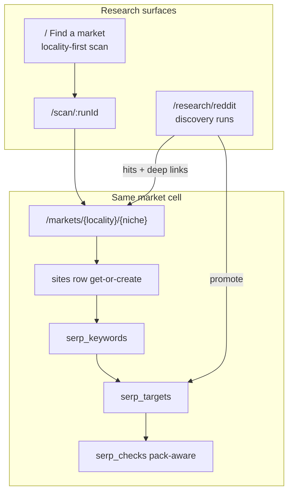
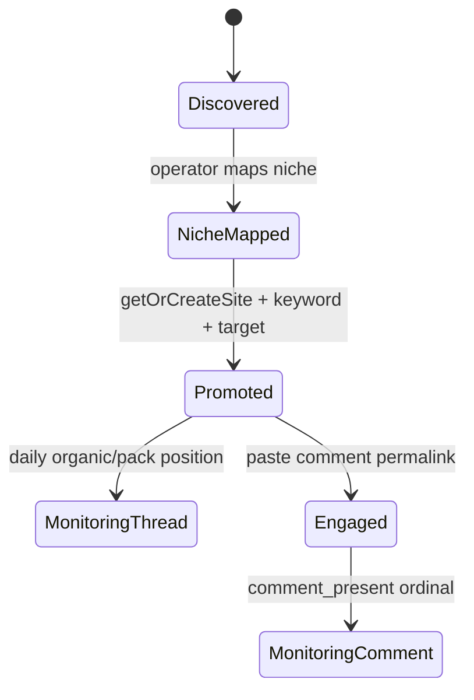

# Design: Reddit SERP Discovery Research Mode

| Field | Value |
|---|---|
| **Title** | Reddit SERP Discovery — niche×geo grid research integrated into Markets |
| **Author** | Engineering (design revision) |
| **Date** | 2026-08-04 |
| **Status** | Draft (rev 3 — residual spend/lifecycle/preflight patches) |
| **Related** | Existing SERP monitoring (`serp_keywords` / `serp_targets` / `serp_checks`), locality-first scan pipeline, Markets UI |

---

## Overview

Operators have already identified the **10 largest home-service niches** (each with two keyword variants, e.g. `electrician` / `electrician near me`) and the **100 largest US geographies by population**. They need a first-class research mode that:

1. Purchases a Google organic SERP for **both keywords × every resolved geo** (~2,000 queries, ≈ $4 at DataForSEO live advanced pricing).
2. Extracts **every Reddit thread on page 1**, recording **organic position** and **discussions-and-forums pack** placement **separately**.
3. Optionally probes whether each thread is still **commentable** (not archived, not locked, OP not deleted).
4. Lets the operator **promote a hit into a market** and turn on the **existing daily SERP monitor** (thread still ranking + our comment ordinal once a comment permalink is attached).

This is **not** a parallel product. It is a **research mode** that feeds the same vocabulary and pipeline the product already has: locality + niche → market (`/markets/{locality}/{niche}`) → site → `serp_keywords` / `serp_targets` / `serp_checks`. Discovery answers *where Reddit is already winning SERPs*; the existing monitor answers *did our engagement hold*.

**Critical gap today:** monitoring (`packages/data/src/serp/run-check.ts`) finds threads the operator already chose (post URL and optionally a comment permalink). There is no bulk discovery path, no discussions-pack capture (`normaliseOrganicResult` strips non-organic items), and no commentability probe. Note: monitoring already supports **post-only** targets (`commentId` null); comment ordinal is measured only when a comment id is present. Discovery promote seeds post-only targets; operators paste comment permalinks later via existing SerpPanel.

---

## Background & Motivation

### Current product model

- **Locality-first research**: pick one place → score every active niche. Home: `apps/web/src/app/page.tsx`.
- **Market** = one locality + one niche, URL `/markets/{localitySlug}/{nicheSlug}`. Unified list replaced `/sites` and `/shortlist` (`apps/web/src/app/markets/`).
- Pipeline: `scan_runs → scan_targets → shortlist_items → sites → calls → leads`.
- SERP monitoring: `sites → serp_keywords → serp_targets → serp_checks` (queue is `serp_targets.next_check_at`, claimed with `FOR UPDATE SKIP LOCKED`).

### What already works (reuse, do not redesign)

| Concern | Location |
|---|---|
| Schema: keywords / targets / checks | `packages/data/src/schema.ts` (`serp_keywords`, `serp_targets`, `serp_checks`) |
| Daily check runner + daily cap | `packages/data/src/serp/run-check.ts` (`SERP_MONITOR_DAILY_CAP_CENTS`, default 17¢/day/cell) |
| Reddit permalink + comment ordinal (pure) | `packages/core/src/serp/reddit.ts` |
| Semrush keyword CSV (forgiving pure parser) | `packages/core/src/serp/keywords.ts` |
| Keyword upsert IO | `packages/data/src/serp/keywords.ts` (`importKeywordCsv` on `(site_id, keyword)`) |
| Regression detection (three-state safe) | `packages/core/src/serp/regressions.ts` (`detectRegressions`) |
| Worker drain | `packages/data/src/worker/main.ts` (voice → SERP → scan); `drain.ts` **`drainQueues` is voice + SERP only** (cron path) |
| Scan BudgetGuard | `packages/data/src/budget.ts` — **process-local, hard-wired to `scan_runs` + `spend_ledger.scanRunId`** |
| DataForSEO organic | `packages/data/src/providers/dataforseo/serp.ts` (`normaliseOrganicResult` organic-only) |
| Page fetch for Reddit HTML | `packages/data/src/providers/dataforseo/instant-pages.ts` (`PRICE.onPageInstantPage`) |
| Site create | `packages/data/src/sites.ts` (`createSite` always INSERTs; default status `parked`; active cell unique via partial index `sites_active_cell_uq` WHERE status <> 'dropped') |
| Start targeting | `apps/web/src/app/markets/actions.ts` — **refuses** if `cell.site !== null` |
| Locality kinds | `LocalityKind = 'city' \| 'county' \| 'metro'` (`packages/core/src/types.ts`) — **not** `place` |
| Scan keyword form | `` `${locality.name.toLowerCase()} ${keywordNoun}` `` in `run-scan.ts` (~L169) |
| Markets + SerpPanel UI | `apps/web/src/app/markets/`, `SerpPanel.tsx` (organic `serpPosition` only today) |
| Geography name helpers | `packages/core/src/geography/names.ts` |

### Pain points / gaps

1. **No discovery**: operator must manually find Reddit threads; cannot sweep niche×geo.
2. **`normaliseOrganicResult` drops packs**: only `type === 'organic'` is kept. Discussions and Forums never reach the app.
3. **No commentability**: `reddit.ts` only does permalink parse + comment ordinal.
4. **Promotion path missing**: no “start watching this thread on this cell” from research context; `createSite` is not get-or-create.
5. **Pack-only monitoring hole**: even after discovery, organic-only `runTargetCheck` cannot truthfully monitor pack-only threads; SerpPanel would still show “not ranking.”

### Cost envelope

| Item | Unit cost | Full grid |
|---|---|---|
| Organic live advanced | $0.002 (`PRICE.serpOrganicLive`) | 10 niches × 2 keywords × 100 geos = **2,000 × $0.002 = $4.00** |
| Optional commentability (instant pages) | $0.00015 | Only on promote / optional pass ≈ **cents** |
| Daily post-promote monitoring | one SERP per target per day (+ optional page if comment attached) | Per-site daily cap (`SERP_MONITOR_DAILY_CAP_CENTS`); many targets on one cell **share** the cap and **defer** via `rescheduleTarget(..., 24)` when spent — promote increases monitor queue contention, not discovery run risk. Pack-aware match still **one** SERP purchase (no double charge). |

---

## Goals & Non-Goals

### Goals

1. **CSV import** for (a) niche list with two keyword variants and (b) top-N US geos by population; map geos onto existing `localities` + `provider_location_code` with a precise resolve algorithm.
2. **Batch discovery job** with concurrent-safe budget, dual-runtime worker drain (`main.ts` **and** `drainQueues`), fixture mode, ledger reconciliation.
3. **Parse Reddit on page 1** from **organic ranks** and from the **discussions_and_forums pack**, stored as distinct source kinds.
4. **Commentability probe** (archived / locked / deleted OP) with three-state discipline; default on promote.
5. **Promote hit → market + monitoring** via **get-or-create site**, upsert keyword, `addSerpTarget` — requires mapped `niche_id`.
6. **Pack-aware daily monitoring + UI** so pack-only threads display and regress correctly.
7. **UI vocabulary** stays locality / niche / market / monitor; discovery results deep-link to market cells in MVP.

### Non-Goals

- Redesigning locality-first scan scoring, difficulty, EMD, or rent modelling.
- Changing scan keyword construction (`` `{city} {noun}` ``) or claiming discovery queries equal scan SERPs.
- Auto-inserting orphan rows into `niches` from CSV labels.
- Replacing Semrush keyword import on the market page.
- Auto-posting comments or any Reddit write path.
- Changing the three-state `comment_present` semantics, or alerting on `commentable === false`.
- Widening unresolved localities to broader location codes.
- Real-time streaming discovery UX.
- Writing raw DFS items into `serp_snapshots` under `se_type = 'organic'`.
- Raising or redesigning `SERP_MONITOR_DAILY_CAP_CENTS` when many threads are promoted.

---

## Proposed Design

### Integration philosophy (locality-first brand)

The **job** is niche×geo (operator-supplied lists). The **surfaces** are cell-centric:

```
Discovery run (batch research)
  → hits keyed by (locality_id, discovery_niche, keyword, reddit_post_id)
  → operator opens /markets/{locality}/{niche}  (requires niche map)
  → promote: get-or-create site + serp_keyword + serp_target (post-only)
  → worker drainSerpOnce runs daily (pack-aware)
  → optional: paste comment permalink in SerpPanel → ordinal monitoring
```

Home (`/`) stays “name one place.” Discovery lives as **Research → Reddit opportunities** (never branded “Keyword research”). **MVP definition of done includes PR 8** (market cell card). PR 7 results **must** deep-link to market URLs when niche is mapped; unmapped niches show “map niche to open market” without inventing slugs.



### End-to-end sequence

```mermaid
sequenceDiagram
  participant Op as Operator
  participant UI as Web UI
  participant DB as Postgres
  participant W as Worker
  participant DFS as DataForSEO

  Op->>UI: Upload niches CSV + geos CSV
  UI->>DB: Parse pure; resolve geos → localities (audit)
  Op->>UI: Map unmatched niches optional; start run (cap)
  UI->>DB: INSERT discovery_runs + jobs (resolved geos only)

  loop claim job where run not terminal FOR UPDATE SKIP LOCKED
    W->>DB: reserveSpendDiscovery (atomic cap check)
    alt reservation failed
      W->>DB: skip remaining pending; run budget_exceeded
    else reserved
      W->>DFS: organic live advanced depth 10
      DFS-->>W: raw items
      W->>W: extractRedditHits pure
      W->>DB: hits + confirm ledger (already reserved)
    end
  end

  Op->>UI: Map niche if needed; promote hit
  UI->>DB: getOrCreateSite + upsert keyword + addSerpTarget
  Note over W,DB: drainSerpOnce pack-aware daily
```

---

## Enqueue contract

### Inputs

```ts
enqueueDiscoveryRun(db, {
  niches: DiscoveryNicheInput[]   // from parseDiscoveryNicheCsv or API
  geos: DiscoveryGeoInput[]       // raw CSV rows; resolved inside enqueue
  budgetCapCents: number          // required; converted to micros
  commentabilityMode: 'none' | 'on_promote' | 'after_discovery'  // default on_promote
  label?: string
  /** Hard ceiling on purchasable jobs. Default 5000. Reject enqueue if exceeded. */
  maxJobs?: number
}): Promise<{ run: DiscoveryRun; preview: EnqueuePreview }>
```

### Expansion rules (normative)

1. **`used_fixtures`**: set at enqueue from `liveCallsEnabled()` — true only when `LIVE_CALLS_ENABLED === 'true'` is false for fixtures, i.e. `usedFixtures = !liveCallsEnabled()` (same polarity as `enqueueScan`).
2. **Resolve geos first** via `resolveDiscoveryGeos` (algorithm below). Persist every CSV geo as a `discovery_geos` row with `resolve_status`.
3. **Jobs only for purchasable cells**: for each discovery niche × each of `{keyword_primary, keyword_near_me}` × each geo with `resolve_status = 'resolved'` **and** (if live) `location_source = 'dataforseo'`:
   - insert one `discovery_jobs` row with `status = 'pending'`.
4. **No job rows** for unresolved / unscannable geos. Progress denominator `job_count` = purchasable only. Audit lives on `discovery_geos`, not as fake skipped jobs.
5. **`job_count` hard cap**: if purchasable jobs > `maxJobs` (default **5000**), **reject enqueue** with counts (do not partially create). Full product grid is 2000; cap is a safety rail.
6. **Keyword form**: store and purchase CSV keywords **verbatim**. Do **not** prepend city name. Geography is `location_code` only. See [Keyword form decision](#keyword-form-decision).
7. **Near-me synthesis**: if CSV has only one keyword column, set `keyword_near_me = \`${primary} near me\`` and flag `near_me_synthesised = true` on the niche row so the UI can show it.
8. Soft-match niches to seed corpus at enqueue (**preview only**); leave `niche_id` null when unmatched. **Promote requires non-null `niche_id`** (operator maps in UI).

### Preview return (before or with enqueue)

```ts
interface EnqueuePreview {
  nicheCount: number
  geoResolved: number
  geoUnresolved: number
  geoUnscannableSource: number
  jobCount: number
  estimatedCostMicros: bigint  // jobCount * PRICE.serpOrganicLive
  budgetCapMicros: bigint
  usedFixtures: boolean
  hardCap: number
}
```

UI shows preview cost and “N geos will not be searched” before confirm.

---

## Keyword form decision

**Closed decision:** Discovery uses operator CSV keywords **verbatim** with DataForSEO `location_code`. It does **not** use the locality-scan form `` `${city} ${noun}` `` from `run-scan.ts` L169.

| Path | Example query | Location |
|---|---|---|
| Locality scan | `tucson electrician` | `location_code` for Tucson |
| Discovery (CSV) | `electrician` / `electrician near me` | same `location_code` |

These are **different Google queries**. Implications:

- Discovery hits on a cell are **not** guaranteed to appear on the same SERP the difficulty model scored.
- Promote seeds `serp_keywords` with the **discovery** string so daily monitoring continues the same query the hit was found on.
- Market cell UI must label discovery hits: *“Found for keyword `electrician near me` (discovery) — not the same query as locality scan `tucson electrician`.”*

**Non-goal for MVP:** import flag `keyword_style: verbatim | city_prefix`. Can be added later without schema break (prepend at job creation).

**Rollout canary (required before full grid):** for one city in live mode, run three queries and manually compare page 1 Reddit: bare `electrician`, `electrician near me`, `{city} electrician`. Document which variants actually surface Reddit. Do not scale to 2k until canary is recorded.

---

## Data model

### `discovery_runs`

| Column | Type | Notes |
|---|---|---|
| `id` | serial PK | |
| `status` | text | `pending` \| `running` \| `done` \| `failed` \| `budget_exceeded` \| `cancelled` — **not** identical to `scan_runs` (which has no `cancelled`; discovery adds it deliberately). Sticky terminal only when `phase = complete`. |
| `budget_cap_micros` | bigint | |
| `spend_micros` | bigint | Updated **only** via atomic reservation SQL |
| `used_fixtures` | boolean | Snapshot at enqueue |
| `niche_count` / `geo_count` / `job_count` | int | `job_count` = purchasable jobs only |
| `jobs_done` / `jobs_failed` / `jobs_skipped` | int | Rollup counters |
| `hit_count` | int | |
| `commentability_mode` | text | `none` \| `on_promote` \| `after_discovery` |
| **`phase`** | text | **`serp` \| `commentability` \| `complete`** — see [Run phases](#run-phases-serp--commentability). Default `serp`. |
| `label` | text null | |
| `started_at` / `finished_at` / `error` | | |
| `created_at` | | |

There is **no** single claim of the whole run for spend safety. Jobs are claimed individually; the **run row is locked only for spend reservation and terminal transitions**.

### `discovery_niches`

| Column | Type | Notes |
|---|---|---|
| `id` | serial PK | |
| `run_id` | FK cascade | |
| `label` | text | |
| `slug` | text null | |
| `niche_id` | int null FK → niches | Required non-null **before promote**; soft-filled at enqueue if match |
| `keyword_primary` | text | |
| `keyword_near_me` | text | |
| `near_me_synthesised` | boolean | default false |
| `import_batch` | text | |
| `line_number` | int null | |

Unique: `(run_id, lower(keyword_primary))`.

### `discovery_geos`

| Column | Type | Notes |
|---|---|---|
| `id` | serial PK | |
| `run_id` | FK | |
| `raw_name` / `raw_state` / `raw_population` / `raw_kind` | | CSV as given; `raw_kind` optional |
| `locality_id` | int null | |
| `provider_location_code` | int null | Copied at resolve |
| `location_source` | text null | Copied |
| `resolve_status` | text | `resolved` \| `unresolved` \| `unscannable_source` |
| `unmatched_reason` | text null | |
| `candidate_count` | int null | How many locality rows matched before disambiguation |
| `import_batch` / `line_number` | | |

### `discovery_jobs` — THE queue

| Column | Type | Notes |
|---|---|---|
| `id` | serial PK | |
| `run_id` / `discovery_niche_id` / `discovery_geo_id` / `locality_id` | FKs | |
| `kind` | text | **`serp` (default) \| `commentability`** — commentability jobs only when mode is `after_discovery` |
| `keyword` | text | Verbatim purchased string (SERP jobs); ignored for commentability |
| `keyword_variant` | text | `primary` \| `near_me` \| null for commentability jobs |
| `discovery_hit_id` | int null FK | Set on `kind = 'commentability'` jobs — which hit to probe |
| `status` | text | `pending` \| `claimed` \| `done` \| `failed` \| `skipped` |
| `claimed_at` / `claimed_by` | | |
| `cost_micros` | bigint default 0 | |
| `error` | text null | |
| `measured_via` | text null | `dataforseo` \| `fixture` |
| `reddit_hit_count` | int default 0 | 0 = measured, no Reddit |
| **`raw_items`** | jsonb null | **Optional persist of DFS `items` for re-extract without re-buy** (see Alternatives) — **MVP: yes, store** |
| `finished_at` | | |

Indexes:

- Claim: partial index on `(id)` WHERE `status = 'pending'` (or `(run_id, id)` WHERE pending).
- Run progress: `(run_id, status)`.

### Job + run lifecycle (normative)

#### Claim

```sql
UPDATE discovery_jobs j
   SET status = 'claimed', claimed_at = now(), claimed_by = $worker
 WHERE j.id = (
   SELECT j2.id
     FROM discovery_jobs j2
     INNER JOIN discovery_runs r ON r.id = j2.run_id
    WHERE j2.status = 'pending'
      AND r.status IN ('pending', 'running')  -- never claim on terminal runs
    ORDER BY j2.id ASC   -- global FIFO; intentional
    LIMIT 1
    FOR UPDATE OF j2 SKIP LOCKED
 )
   AND j.status = 'pending'
 RETURNING j.id
```

On first successful claim for a run still `pending`, set run → `running` and `started_at = now()`.

#### Concurrent-safe spend (critical)

**Do not use `BudgetGuard` as written** (`packages/data/src/budget.ts`: process-local `this.spent`, always writes `scanRunId` and updates `scan_runs`).

```ts
/**
 * DiscoveryBudgetGuard — DB-authoritative reservation.
 * Safe under concurrent workers (pnpm worker + cron drainQueues).
 *
 * ==================== RESERVE THE ACTUAL CHARGE, NOT A LIVE ESTIMATE UNDER FIXTURES ====================
 * Scan path books actual cost via BudgetGuard.record after the provider returns (0 under fixtures).
 * Discovery reserves before the call so concurrent workers cannot overspend — but the reserved
 * amount MUST equal what will be charged:
 *
 *   reserveCost =
 *     job.kind === 'serp'
 *       ? (providers.live ? PRICE.serpOrganicLive : 0n)
 *       : (providers.live ? PRICE.onPageInstantPage : 0n)
 *
 * Live organic today: estimate === actual ($0.002). Live instant page: $0.00015.
 * Fixture: always 0n. Still INSERT a spend_ledger row (cost 0, endpoint serp/discovery or
 * serp/discovery/commentability) so e2e can prove the path ran and reconcile totals === 0n.
 * ======================================================================================================
 */
async function reserveDiscoverySpend(
  db: Database,
  args: {
    runId: number
    costMicros: Micros  // MUST be 0n when !providers.live
    endpoint: string
    note: string
    jobId: number
  },
): Promise<'ok' | 'budget_exceeded' | 'run_terminal'> {
  // Single transaction:
  // 1. Lock run: SELECT status, phase, spend_micros, budget_cap_micros FROM discovery_runs WHERE id=$id FOR UPDATE
  // 2. If status not in (pending, running) → run_terminal
  // 3. If spend + cost > cap → budget_exceeded (do not write)
  // 4. Else:
  //    UPDATE discovery_runs SET spend_micros = spend_micros + cost WHERE id = $id
  //      (cost may be 0 — still bumps nothing; ledger row still written)
  //    INSERT spend_ledger (discovery_run_id, endpoint, cost_micros, note)
  //    return ok
}
```

Equivalent single-statement form for the increment (still inside a transaction that has checked status):

```sql
UPDATE discovery_runs
   SET spend_micros = spend_micros + $cost
 WHERE id = $runId
   AND status IN ('pending', 'running')
   AND spend_micros + $cost <= budget_cap_micros
 RETURNING spend_micros
```

Zero rows returned → either terminal or over cap; re-read status to distinguish.

**When `costMicros === 0n`:** still require status `pending|running`, still insert ledger row with `cost_micros = 0`, do **not** treat as budget_exceeded (0 never breaches cap). This is the fixture path and matches scan’s zero-cost ledger proof.

**Order of operations per SERP job (`kind = 'serp'`):**

1. Claim job (run must be non-terminal; see claim SQL).
2. **Live account preflight** (once per run — see [Account preflight](#account-preflight-live)).
3. `reserveCost = providers.live ? PRICE.serpOrganicLive : 0n`
4. `reserveDiscoverySpend({ costMicros: reserveCost, endpoint: 'serp/discovery', ... })` **before** provider call.
5. If `budget_exceeded` → mark this job `skipped` with error `budget_exceeded`; call `finalizeRunBudgetExceeded(runId)`; return.
6. If `run_terminal` → mark job `skipped` with reason `run_cancelled_or_done`; return.
7. Call provider; on throw after reservation: mark job `failed`. Live: ledger already has $0.002 (DFS may have billed — no refund in MVP). Fixture: ledger has $0.
8. Extract hits; store `raw_items`; mark job `done`; increment run counters.
9. After all SERP jobs terminal for the run → [phase transition](#run-phases-serp--commentability).

**PR 4 e2e acceptance (fixtures):** `reconcileDiscoverySpend` → `runTotal === ledgerTotal === 0n`, `lineItems === job_count` (one zero row per SERP job, plus zero rows for any commentability jobs).

#### On budget exceeded

```sql
-- finalizeRunBudgetExceeded
UPDATE discovery_runs
   SET status = 'budget_exceeded', finished_at = now(),
       error = COALESCE(error, '') || 'Budget cap reached. '
 WHERE id = $runId AND status IN ('pending', 'running');

UPDATE discovery_jobs
   SET status = 'skipped', finished_at = now(),
       error = 'Skipped: run budget exceeded.'
 WHERE run_id = $runId AND status = 'pending';
```

In-flight `claimed` jobs: finish normally if they already reserved spend; if they have not yet reserved, their next reserve sees terminal/exceeded and skips. Redrive of stuck `claimed` (see redrive) moves abandoned claims to `pending` only if run still `running`; if run is terminal, redrive → `skipped`.

#### On cancel (operator)

```sql
UPDATE discovery_runs SET status = 'cancelled', finished_at = now()
 WHERE id = $runId AND status IN ('pending', 'running');

UPDATE discovery_jobs SET status = 'skipped', error = 'Skipped: run cancelled.', finished_at = now()
 WHERE run_id = $runId AND status = 'pending';
```

Claimed jobs may complete and write hits (spend already reserved); that is acceptable. No new claims after cancel.

#### Run phases (serp → commentability)

`after_discovery` probes **cannot** call `reserveDiscoverySpend` after the run is rolled up to `done` (status gate). Phases keep the run `running` until probes finish.

| `phase` | Meaning |
|---|---|
| `serp` | Purchasing organic SERPs (`kind = 'serp'` jobs). Initial value. |
| `commentability` | Probing hits (`kind = 'commentability'` jobs). Only entered when `commentability_mode = 'after_discovery'`. |
| `complete` | All work for this run finished; set together with terminal `status`. |

**Transition when last SERP job leaves `pending|claimed`:**

```
if commentability_mode == 'after_discovery'
   AND status still running
   AND exists hits with commentable IS NULL:
  INSERT discovery_jobs (kind='commentability', discovery_hit_id=..., status='pending', run_id=...)
    for each distinct reddit_post_id hit (one probe per post, not per source_kind duplicate)
  SET phase = 'commentability'
  -- status remains 'running'; do NOT set done yet
else:
  SET phase = 'complete'
  rollup terminal status (done / failed / …)
```

**Commentability job order of operations (`kind = 'commentability'`):**

1. Claim (same claim SQL; run still `running`, phase `commentability`).
2. `reserveCost = providers.live ? PRICE.onPageInstantPage : 0n`
3. `reserveDiscoverySpend({ endpoint: 'serp/discovery/commentability', costMicros: reserveCost })`
4. `fetchPageHtml(oldRedditThreadUrl(postId))` → `probeCommentability` → update hit `commentable` three-state
5. On fetch/parse failure: `commentable = NULL` (never false); job `done` with error note (probe failures are measurements of unknown, not run failure)
6. When no more commentability jobs pending/claimed → `phase = complete` + rollup terminal status

**Cancel / budget_exceeded** during `commentability` phase: same bulk-skip of remaining `pending` jobs; sticky terminal status; `phase = complete`.

Modes:

| Mode | Behaviour |
|---|---|
| `none` | No probes. SERP done → `phase=complete`, status rollup. |
| `on_promote` | No discovery-run probes. SERP done → complete. Probe at promote time under **site** ledger (below). |
| `after_discovery` | Enqueue commentability jobs; stay `running` until probes drain or cancel/budget. |

#### Rollup final status

Call `rollupDiscoveryRun(runId)` after each job terminal state and on cancel/budget. **Do not set `status = done` while `phase = commentability` and jobs remain.**

| Condition | Final `discovery_runs.status` |
|---|---|
| Any job still `pending` or `claimed` and run not cancelled/exceeded | `running` (or `pending` if never started); phase `serp` or `commentability` |
| Operator cancelled | `cancelled` (sticky); `phase = complete` |
| Budget exceeded path taken | `budget_exceeded` (sticky); `phase = complete` |
| `phase = complete`; no pending/claimed; at least one SERP `failed` and zero SERP `done` | `failed` |
| `phase = complete`; no pending/claimed; ≥1 SERP `done` (rest skipped/failed ok; probes optional) | `done` |
| `phase = complete`; no pending/claimed; all skipped (e.g. cancel before any work) | `cancelled` if cancel, else `done` |

### `discovery_hits`

| Column | Type | Notes |
|---|---|---|
| `id` | serial PK | |
| `job_id` / `run_id` / `locality_id` / `discovery_niche_id` | | |
| `niche_id` | int null | Denorm from discovery_niches at insert time |
| `keyword` | text | |
| `reddit_url` / `reddit_post_id` / `subreddit` / `title` | | |
| `source_kind` | text | `organic` \| `discussions_and_forums` |
| `organic_position` | int null | |
| `rank_absolute` | int null | |
| `pack_position` | int null | |
| `domain` | text | |
| `commentable` | boolean null | Three-state |
| `commentable_detail` | text null | |
| `commentable_checked_at` | timestamptz null | |
| `promoted_site_id` / `promoted_keyword_id` / `promoted_target_id` | null FKs | |
| `created_at` | | |

Unique: `(job_id, reddit_post_id, source_kind)`.

### Spend ledger

```sql
ALTER TABLE spend_ledger
  ADD COLUMN discovery_run_id integer REFERENCES discovery_runs(id) ON DELETE CASCADE;
CREATE INDEX spend_ledger_discovery_run_idx ON spend_ledger(discovery_run_id);
```

Endpoints (string constants):

- `serp/discovery` — organic SERP for a discovery job
- `serp/discovery/commentability` — instant pages probe

Helpers (new, parallel to scan `BudgetGuard` / `reconcileSpend` — **do not overload** scan guard):

```ts
reserveDiscoverySpend(...)   // costMicros is 0n under fixtures — still inserts ledger row
reconcileDiscoverySpend(db, runId): Promise<{
  runTotal: Micros
  ledgerTotal: Micros
  matches: boolean
  lineItems: number
}>
// ledger filter: spend_ledger.discovery_run_id = runId
// e2e fixtures: runTotal === ledgerTotal === 0n, matches true, lineItems > 0
```

Monitor path continues to write ledger with `siteId` + `endpoint: 'serp/monitor'` (unchanged; no DiscoveryBudgetGuard).

### `serp_checks` extensions

```sql
ALTER TABLE serp_checks
  ADD COLUMN serp_pack_position integer,
  ADD COLUMN serp_source_kind text;  -- 'organic' | 'discussions_and_forums' | 'both' | null
```

`serp_position` remains organic `rank_group` when present (backward compatible). `comment_present` unchanged.

---

## Geo CSV → localities resolution (precise algorithm)

File: `packages/data/src/serp/resolve-discovery-geos.ts`  
Reuse name normalizers from `packages/core/src/geography/names.ts` (e.g. legal suffix stripping where applicable) — **do not** invent ad-hoc equality only.

### CSV fields

| Field | Required | Aliases |
|---|---|---|
| `name` | yes | city, name, place, geography, locality |
| `state` | **yes** | state, state_code, st |
| `population` | no | population, pop |
| `kind` | no | kind, type, geo_kind → `city` \| `county` \| `metro` |

Missing `state` → row `unresolved`, reason `missing_state` (never guess state).

### Algorithm (per row)

1. Normalise state to 2-letter code (accept full state name via existing helpers if available; else fail `bad_state`).
2. Normalise name: trim; apply `names.ts` stripping rules carefully (case-sensitive legal suffixes).
3. Determine target kinds:
   - If CSV `kind` present → only that `LocalityKind`.
   - Else **default policy for top-pop CSVs**: try `city` first; if zero matches, try `metro`; if zero, try `county`. Record which kind matched. **Never** invent a kind string `place`.
4. Query candidates: `localities` where `state_code = ?` AND `kind IN (...)` AND lower(name) = lower(normalised) OR search_text match.
5. **Disambiguation** when `candidate_count > 1`:
   - If CSV population present: pick min `|pop - raw_population|`; ties → larger population.
   - Else: pick largest population; if still tied → `unresolved` with reason `ambiguous_name` (do not silently pick).
6. If zero candidates → `unresolved` / `no_locality_match`.
7. If matched but `provider_location_code` is null → `unresolved` / `no_provider_code` (same as unscannable for purchase).
8. If live enqueue path (`!usedFixtures`) and `location_source !== 'dataforseo'` → `unscannable_source` (matches `run-scan.ts` refusal; **never widen**).
9. Fixture runs: allow any resolved code present in fixture location list; e2e CSVs must use fixture cities only (Kenosha, Tucson, McKinney, etc. from `FixtureProviders.fetchLocations`).

### Metro / county policy

| CSV content | Policy |
|---|---|
| Explicit kind=metro/county | Match that kind only |
| Bare “Chicago” / high pop name without kind | city first, then metro (MSAs often appear in top-100 lists) |
| “Cook County” | kind=county or name contains “County” → prefer county match |
| No match | skip searching; show in preview audit; **no job rows** |

Return per-row audit to UI: `matched_locality_id`, `candidate_count`, `resolve_status`, `unmatched_reason`.

---

## Niche mapping (closed decision)

**Require map to seeded `niches` before promote.** Auto-insert of orphan niches is rejected.

| Stage | Rule |
|---|---|
| Enqueue / import | Soft-match by slug or lower(label) ≈ lower(niches.label) / keyword_noun; fill `discovery_niches.niche_id` when confident; leave null otherwise |
| Browse hits | Allowed with null niche_id (research table still useful) |
| Deep-link to market | Only if `niche_id` set → `/markets/{locality.slug}/{niche.slug}` |
| **Promote** | **Hard fail** if `discovery_niches.niche_id` is null: UI forces pick from `niches WHERE active` and writes the FK first |

This unblocks `/markets/{locality}/{niche}` and `sites.nicheId` without polluting the seed corpus.

---

## Pure core: SERP Reddit extraction

`packages/core/src/serp/discovery.ts`:

```ts
export type RedditSerpSourceKind = 'organic' | 'discussions_and_forums'

export interface RedditSerpHit {
  url: string
  postId: string
  subreddit: string | null
  title: string | null
  sourceKind: RedditSerpSourceKind
  organicPosition: number | null
  rankAbsolute: number | null
  packPosition: number | null
  domain: string
}

/** Never throws on unknown shapes — returns [] or partial hits. */
export function extractRedditHitsFromDfsResult(result: {
  items?: Array<Record<string, unknown>> | null
}): RedditSerpHit[]

/** Shared by discovery and monitor. */
export function findRedditPlacement(
  items: Array<Record<string, unknown>>,
  postId: string,
): {
  organicPosition: number | null
  packPosition: number | null
  rankAbsolute: number | null
  sourceKind: 'organic' | 'discussions_and_forums' | 'both' | null
}
```

- Organic: `type === 'organic'`, Reddit domain, `parseRedditPermalink` ok.
- Pack: `type === 'discussions_and_forums'`, nested `items` with `type === 'discussions_and_forums_element'` (names from DataForSEO docs — **must be validated against live canary / real capture in PR 3**). Also accept elements that merely have reddit URLs if type string differs slightly.
- Share links → skip (parser returns null).
- Unknown nest → ignore element, do not throw.

---

## Pure core: commentability probe

Extend `packages/core/src/serp/reddit.ts`:

```ts
export type CommentabilityOutcome =
  | { status: 'open' }
  | { status: 'closed'; reasons: Array<'archived' | 'locked' | 'op_deleted'> }
  | { status: 'unknown'; reason: string }

export function probeCommentability(html: string): CommentabilityOutcome {
  // 1. empty → unknown
  // 2. looksBlocked(html) → unknown  (MUST reuse existing helper; never closed)
  // 3. apply closed heuristics only on clear markers
  // 4. if any closed marker matched with high confidence → closed
  // 5. if markup incomplete / no OP region found → unknown
  // 6. else open
}
```

**Bias (same as ordinal parser):** any ambiguity → `unknown` → DB `commentable = NULL`. Never guess closed.

Unit fixtures required: block page, archived, locked, deleted OP, empty, open happy path.

**Alerting:** `commentable === false` is a **UI badge only**. It is **not** a `detectRegressions` kind and never pages the operator. Non-goal: commentability regressions.

Default mode: **`on_promote`** (no discovery-run phase). Mode **`after_discovery`** uses run-scoped `kind = 'commentability'` jobs while status stays `running` — see [Run phases](#run-phases-serp--commentability). Do **not** call `reserveDiscoverySpend` after status is terminal.

### `on_promote` spend attribution (normative)

Promote-time probes run **after** the discovery run is usually `done`. They **must not** call `reserveDiscoverySpend` (terminal gate).

```ts
// After get-or-create site, when hit.commentable === null and
// (run.commentability_mode === 'on_promote' OR always probe on promote if still null):
async function probeHitOnPromote(db, providers, hit, siteId): Promise<void> {
  const cost = providers.live ? PRICE.onPageInstantPage : 0n
  try {
    const page = await providers.fetchPageHtml(oldRedditThreadUrl(hit.redditPostId))
    const outcome = probeCommentability(page.html)
    // map to commentable true | false | null; fail → null never false
    await updateHitCommentable(db, hit.id, outcome)
  } catch {
    await updateHitCommentable(db, hit.id, { status: 'unknown', reason: 'fetch failed' })
  }
  // Always ledger — money discipline — even when cost is 0n
  await db.insert(spendLedger).values({
    siteId,                    // cell that benefits
    discoveryRunId: hit.runId, // audit trail only; NOT used for cap reservation
    scanRunId: null,
    endpoint: 'serp/discovery/commentability',
    costMicros: cost,          // actual charge (0 under fixtures)
    note: `on_promote hit ${hit.id}`,
  })
}
```

| Field | Value |
|---|---|
| Cap / reservation | **None** against discovery run (already terminal). **Not** counted against `SERP_MONITOR_DAILY_CAP_CENTS` either — sub-cent optional cost at human-triggered promote; uncapped at operator scale (dozens of promotes, not thousands/day). |
| Ledger | Required; `site_id` set; `discovery_run_id` set for audit when known |
| Failure | `commentable = NULL`; promote still succeeds |

---

## Account preflight (live)

Mirror `run-scan.ts` L145–162. Empty SERPs under a paused/unfunded account look like “no Reddit opportunities.”

**When:** first live SERP job claimed for a run (or once at start of `runDiscoveryJob` when `providers.live && run has no jobs_done yet`). Fixture mode: skip entirely.

```ts
if (providers.live) {
  const status = await providers.accountStatus()
  if (status && !status.canMakeRequests) {
    // Mark run failed; bulk-skip all pending jobs; phase = complete
    // error: `DataForSEO balance is $X. Refusing discovery — empty SERPs would look like zero Reddit hits.`
    return
  }
}
```

Do not start hundreds of jobs after a failed preflight. Re-check is optional later mid-run if desired; MVP once-at-start is enough.

---

## Provider seam (scoring cache safety)

```ts
// Providers — ADDITIVE only
fetchOrganicSerpDetailed(ctx: FixtureContext): Promise<{
  snapshot: SerpSnapshot           // still via normaliseOrganicResult
  rawItems: Array<Record<string, unknown>>
  costMicros: Micros
}>
```

**Hard rules:**

1. `fetchOrganicSerp` behaviour remains **byte-stable** for scoring callers.
2. **Never** `writeSerpCache` raw DFS items under `se_type = 'organic'`. Existing cache stores normalised `SerpSnapshot` only (`cache.ts`).
3. Discovery does **not** read organic cache for pack extraction (normalised payload has no packs). MVP always live/fixture purchase; re-extract from `discovery_jobs.raw_items` if extractor bugs ship later.
4. Contract test: after detailed fetch lands, `normaliseOrganicResult` output still organic-only; scoring e2e unchanged.
5. Optional future: separate `se_type = 'organic_raw'` cache — **non-goal for MVP**.

### Fixture synthesis (deterministic)

In `packages/data/src/providers/fixtures/`:

```ts
// Seed: `discovery:${keyword}:${locationCode}` via existing Rng
// ~15% of SERPs include ≥1 organic Reddit result (post id derived from hash)
// ~10% include a discussions_and_forums block with 1–3 elements (mix Reddit + Quora)
// ~5% include both
// Titles/subreddits deterministic from seed
// Enables e2e: enqueue fixture run → hits > 0 without live DFS
```

---

## Data layer: runner

`packages/data/src/serp/run-discovery.ts`:

```ts
claimNextDiscoveryJob(db, workerId)
runDiscoveryJob(db, { job, providers })
finalizeRunBudgetExceeded(db, runId)
cancelDiscoveryRun(db, runId)
rollupDiscoveryRun(db, runId)
redriveStuckDiscoveryJobs(db): number  // STUCK_DISCOVERY_JOB_MINUTES = 20
```

### Redrive

```sql
-- claimed longer than 20 minutes
-- if run still running/pending → set job pending, clear claim
-- if run terminal → set job skipped
```

Constant: `STUCK_DISCOVERY_JOB_MINUTES = 20` (same class as `STUCK_RUN_MINUTES` in `queue.ts`).

---

## Worker integration (dual runtime)

### Priority

| Order | Path | Where |
|---|---|---|
| 1 | Voice | `drainVoiceOnce` — main + `drainQueues` |
| 2 | SERP monitor | `drainSerpOnce` — main + `drainQueues` |
| 3 | **Discovery** | **`drainDiscoveryOnce` — main + `drainQueues` (required)** |
| 4 | Locality scan | `claimNextRun` — **main.ts only** (unchanged; scans stay off cron) |

Today `drainQueues` only drains voice + SERP. **PR 4 must update both:**

- `packages/data/src/worker/main.ts` tick order
- `packages/data/src/worker/drain.ts`: `DrainCounts` adds `discovery`; `drainQueues` loop calls `drainDiscoveryOnce` after SERP; cron logs include discovery count

### Capacity

| Runtime | Expectation |
|---|---|
| Long-lived `pnpm worker` | Full 2k grid practical: ~1 job / few seconds → ~1–3 hours at concurrency 1 |
| Vercel cron `drainQueues` | Wall-clock budget ~45s/min; at 1 job per invocation progress is **hours to days**. Full grid **assumes `pnpm worker`** (or raise concurrency / cron budget). |
| Fairness | SERP daily-cap defer still returns `true` (did work). Discovery may starve under heavy SERP. Mitigation: `DISCOVERY_MAX_JOBS_PER_DRAIN` (default 1 on cron, 3 on worker via env). Document in ops notes. |

Env:

- `DISCOVERY_MAX_JOBS_PER_DRAIN` (default 1)
- `DISCOVERY_DEFAULT_CAP_CENTS` (default 500)
- `STUCK_DISCOVERY_JOB_MINUTES` (default 20)
- Reuse `LIVE_CALLS_ENABLED`

---

## Promote → monitor path (get-or-create)

**Do not** call `createSite` blindly or mirror `startTargetingAction`’s refuse-if-exists behaviour.

```ts
async function promoteDiscoveryHit(db, args: {
  hitId: number
  /** Required if discovery_niches.niche_id still null */
  nicheId?: number
  commentPermalink?: string | null  // optional; post-only default
}): Promise<{ siteId: number; keywordId: number; targetId: number }>
```

### Steps (normative)

1. Load hit + job + discovery_niche + locality.
2. Resolve `nicheId`: args override or `discovery_niches.niche_id`. If still null → throw `PromoteError('Map this discovery niche to a seeded niche before promoting.')`.
3. Persist map on `discovery_niches` if newly provided.
4. **Get-or-create site (race-safe):**
   ```ts
   async function getOrCreateSiteForCell(db, { localityId, nicheId }): Promise<Site> {
     const [existing] = await db.select().from(sites).where(
       and(eq(sites.localityId, localityId), eq(sites.nicheId, nicheId), sql`status <> 'dropped'`),
     ).limit(1)
     if (existing) return existing
     try {
       return await createSite(db, {
         localityId, nicheId, domain: null, status: 'building',
       })
     } catch (e) {
       // Concurrent promote: both saw no row; one wins sites_active_cell_uq, loser re-selects.
       if (!/sites_active_cell_uq/.test((e as Error).message ?? '')) throw e
       const [winner] = await db.select().from(sites).where(
         and(eq(sites.localityId, localityId), eq(sites.nicheId, nicheId), sql`status <> 'dropped'`),
       ).limit(1)
       if (!winner) throw e
       return winner
     }
   }
   ```
5. **Upsert keyword** on `(site_id, keyword)` — same conflict target as `importKeywordCsv`:
   ```ts
   insert serp_keywords { siteId, keyword: hit.keyword, importBatch: `discovery:${runId}`, active: true, volume/difficulty null }
   onConflictDoUpdate → set active true, importBatch
   ```
   Existing Semrush metadata on that keyword is **preserved** if conflict set only touches null-safe fields: on conflict, do **not** overwrite non-null volume/difficulty from Semrush with nulls. Prefer: `onConflictDoUpdate` set `active = true` only when row exists; leave volume/difficulty as-is.
6. **`addSerpTarget`** with thread URL / post id; comment fields only if `commentPermalink` parse succeeds. Idempotent via existing `(keyword_id, url)` upsert.
7. Optionally set `serp_targets` label to include source_kind (`r/foo · discussions pack`).
8. If `hit.commentable === null` → **`probeHitOnPromote`** ([on_promote spend attribution](#on_promote-spend-attribution-normative)): site-ledger, **not** `reserveDiscoverySpend`. Fail → leave null.
9. If `commentable === false` → return warning string; still allow SERP-only watch.
10. Set `discovery_hits.promoted_*` FKs.
11. **Idempotent re-promote:** if `promoted_target_id` already set and target exists → return existing ids; do not create another site or target.

**Interaction with existing monitoring:** promoting onto a cell that already has Semrush keywords and other targets **adds** one keyword (if new) and one target. Does not disable or replace other targets. Daily cap is shared across all targets for that `site_id`.



---

## Pack-aware monitoring + UI (MVP — not backend-only)

### Backend (`run-check.ts`)

1. Use `fetchOrganicSerpDetailed` (or raw items) instead of organic-only snapshot for match.
2. `findRedditPlacement(rawItems, postId)` → write:
   - `serp_position` = organic position or null
   - `serp_pack_position` = pack position or null
   - `serp_source_kind` = organic | discussions_and_forums | both | null if neither
   - `serpMeasured = true` when SERP call succeeded
3. “Found” for continuity: organic **or** pack present.

### Regressions (`regressions.ts`)

Extend `SerpCheckPoint`:

```ts
serpPackPosition: number | null
serpSourceKind: 'organic' | 'discussions_and_forums' | 'both' | null
```

| Kind | Rule |
|---|---|
| `thread_deindexed` | Previous had organic **or** pack placement; latest measured with **neither**. Message: *thread was at organic #N / Discussions #M and is now nowhere on page 1 (organic or Discussions pack).* |
| `thread_slipped` | Organic positions both non-null and slip ≥ `SLIP_THRESHOLD` (unchanged) |
| `pack_dropped` | **Phase 2 / optional** — previous pack non-null, latest pack null, organic still present |
| comment_* | Unchanged; still only true→false for removal |

First check never regresses (previous null).

### SerpPanel + listSerpTargets (same PR as backend or PR 5b — **required with PR 5**)

`SerpTargetRowView` adds `serpPackPosition`, `serpSourceKind`.

**Thread rank cell display logic:**

| serpMeasured | organic | pack | Display |
|---|---|---|---|
| false | — | — | em dash (unmeasured) |
| true | #N | null | `#N` |
| true | null | #P | `Discussions #P` (badge ok, not stop) |
| true | #N | #P | `#N · Disc #P` |
| true | null | null | `not ranking` (stop badge) |

Update empty-state copy: monitoring can be **post-only** (“paste comment permalink when you engage”); discovery-promoted targets often start post-only.

`countRegressions` automatically picks up new messages once `detectRegressions` is extended.

---

## UI surfaces

| Surface | Role | MVP? |
|---|---|---|
| `/research/reddit` | Runs list, CSV import, preview cost/resolve audit, start run | Yes (PR 7) |
| `/research/reddit/[runId]` | Progress, spend, hits table; filters; **deep-link to market when niche mapped** | Yes (PR 7) |
| `/markets/{locality}/{niche}` | **Reddit opportunities** card + promote CTA | Yes (PR 8 — **DoD for “not bolted on”**) |
| SerpPanel | Pack-aware rank display | Yes (PR 5) |
| Markets list badge “N opps” | Optional | PR 9 |

Nav label: **“Reddit opportunities”** / Research — never “Keyword research.”

Default hit sort: locality population desc, then name.

---

## API / Interface Changes

### Core (`@rnr/core`)

```ts
export {
  extractRedditHitsFromDfsResult,
  findRedditPlacement,
  parseDiscoveryNicheCsv,
  parseDiscoveryGeoCsv,
  probeCommentability,
  // types...
}
```

### Data (`@rnr/data`)

```ts
enqueueDiscoveryRun(db, args)
previewDiscoveryResolve(db, { nichesCsv, geosCsv })  // no write
claimNextDiscoveryJob / runDiscoveryJob / cancelDiscoveryRun
redriveStuckDiscoveryJobs
reserveDiscoverySpend / reconcileDiscoverySpend
promoteDiscoveryHit  // get-or-create site
listDiscoveryRuns / listDiscoveryHits / listHitsForCell
mapDiscoveryNiche(db, { discoveryNicheId, nicheId })
```

### Web actions

```ts
previewDiscoveryAction(fd) 
enqueueDiscoveryAction(fd)
cancelDiscoveryAction(fd)
mapDiscoveryNicheAction(fd)
promoteDiscoveryHitAction(fd)
```

---

## Alternatives Considered

### 1. Hijack `scan_runs` for multi-locality grids — Rejected

Scan is one-locality × all niches with full scoring. Discovery is many-localities × few keywords, organic-only. Different lifecycle and budget concurrency model.

### 2. Write hits straight into `serp_targets` — Rejected

Explodes monitoring cost; forces site creation before research decision.

### 3. Niche-first primary nav — Rejected

Conflicts with locality-first brand. Grid is job shape only.

### 4. New SERP vendor — Rejected for MVP

Stay on DataForSEO client, ledger, credentials.

### 5. Persist raw DFS `items` on `discovery_jobs` — **Accepted for MVP**

**Trade-off:** ~few KB JSON per job × 2k ≈ low MB storage vs re-spend $0.002 to re-extract after extractor bugs. Store `raw_items` on successful SERP jobs. Reprocessing script can rebuild hits without provider calls. Rejected alternative: always re-buy (wasteful). Non-goal: using this as a substitute for `serp_snapshots` scoring cache.

### 6. Discovery depth 100 for parity with monitor — Rejected for MVP

Product asks front page only; `depth: 10`. Monitor keeps depth 100 for slip detection below page 1.

---

## Security & Privacy Considerations

| Topic | Treatment |
|---|---|
| Spend | Atomic DB reservation; hard job cap 5000; preview before confirm |
| Location | Never widen; live requires `dataforseo` source |
| Alert integrity | No alerts on NULL commentable/comment_present |
| PII | Thread titles may contain usernames; operator-only tool |

---

## Observability

- Run progress + spend vs cap
- Worker logs: `Discovery #job … hits=N cost=$`
- `reconcileDiscoverySpend` for e2e and ops
- Redrive counts for stuck claimed jobs
- Cron: `DrainCounts.discovery`
- Fixture banner via `used_fixtures`

---

## Rollout Plan

1. Schema + pure parsers + empty routes (no spend).
2. Fixture dogfood: enqueue → jobs → hits; `reconcileDiscoverySpend` matches; spend === 0.
3. **Live canary (required):** 1 niche × 5 geos; capture real DFS payload with discussions pack; freeze extractor types; **keyword form matrix** (bare / near me / city prefix) for one city.
4. Pack-aware monitor + SerpPanel on one manual target.
5. Full grid with $5 cap on long-lived worker.
6. Promote + daily check path.
7. Rollback: `cancelDiscoveryRun`; nav flag off. Pack-aware checks remain backward compatible (null pack fields).

---

## Risks

| Risk | Severity | Mitigation |
|---|---|---|
| Concurrent overspend | **Critical** | DB-conditional `reserveDiscoverySpend`; never process-local BudgetGuard |
| Promote duplicate site | **Critical** | get-or-create by active cell |
| Pack-only invisible in UI | **High** | SerpPanel + regression messages in same ship as backend |
| Pack-only false deindex | **High** | `findRedditPlacement` in monitor |
| DFS pack shape drift | Medium | Live capture in PR 3; extractor ignores unknown |
| Commentability false closed | Medium | looksBlocked first; ambiguity → unknown |
| Cron too slow for full grid | Medium | Document worker requirement; env concurrency |
| Keyword form ≠ scan SERP | Medium | UI labels; canary matrix |
| Niche unmapped | Medium | Hard gate on promote |
| Cache poison raw organic | High | Never write raw under se_type organic; additive detailed fetch only |

---

## Open Questions

1. ~~Niche mapping~~ → **Closed** in Key Decisions / [Niche mapping](#niche-mapping-closed-decision).
2. ~~Keyword form~~ → **Closed** in [Keyword form decision](#keyword-form-decision).
3. **Depth:** Closed — discovery `depth: 10`; monitor depth 100.
4. **Alerting channel:** Still out of band (in-UI only) unless product requests SMS later.
5. **Multi-thread promote:** Supported (many targets per site) — no open issue.

---

## Key Decisions

| Decision | Rationale |
|---|---|
| Separate `discovery_*` tables; `serp_*` only after promote | Research ≠ monitor; cost and noise control |
| Per-job claim + **DB-atomic spend reservation** | Concurrent workers cannot overspend; scan `BudgetGuard` is process-local and scan_runs-wired |
| **Reserve actual cost: live price or `0n` under fixtures** | Fixture e2e must have spend_micros === ledger === 0; never book $0.002 on fixture runs |
| New `DiscoveryBudgetGuard` / `reserveDiscoverySpend` + `reconcileDiscoverySpend` | Do not overload `BudgetGuard.record` (hard-coded `scanRunId`) |
| **`phase` + `kind=commentability` jobs for `after_discovery`** | Keeps run `running` until probes finish; reserve still valid; sticky `done` only after phase complete |
| **`on_promote` probe: site ledger, no run reservation** | Run is often terminal; still ledgered (`site_id` + optional `discovery_run_id` audit); uncapped sub-cent |
| **Live account preflight once per run** | Same trap as scan: empty SERPs look like zero Reddit hits |
| **Promote get-or-create catches `sites_active_cell_uq`** | Concurrent promotes re-select winner |
| **No job rows for unresolved geos**; audit on `discovery_geos` | Clean progress denominators; job_count = purchasable only |
| Hard cap **5000 jobs** at enqueue | Safety rail against huge CSVs |
| CSV keywords **verbatim** + `location_code`; **≠** scan `` `{city} {noun}` `` | Matches product CSV; document measurement split; canary before full grid |
| Geo resolve: require state; `LocalityKind` city→metro→county; names.ts; no widen | Matches real corpus; fixes wrong `place` kind |
| **Niche map required before promote**; no orphan niche inserts | Markets URLs and sites.nicheId need seed corpus |
| Run lifecycle: budget_exceeded/cancel bulk-skip pending; claim only non-terminal runs | Stops workers after stop |
| Store `raw_items` on jobs | Re-extract without re-spend |
| Pack-aware monitor **and** SerpPanel/regression copy in MVP | Backend-only fix is invisible / looks broken |
| Promote = **get-or-create** active site by cell (+ unique-violation retry) | `createSite` always inserts; startTargeting refuses — neither is correct alone |
| Commentability default `on_promote`; unknown-biased; no regression alerts | Cost + alert integrity |
| Worker: voice → SERP → discovery → scan; **drainQueues must drain discovery** | Cron path otherwise never runs discovery |
| Full grid assumes long-lived worker | Cron budget insufficient for 2k jobs |
| Never cache raw under `se_type=organic` | Protects difficulty scoring |
| `used_fixtures` from `liveCallsEnabled()` at enqueue | Same polarity as scans |
| PR 8 (cell card) is MVP DoD for integration | Avoids bolt-on research island |

---

## References

- README — Markets / SERP monitoring three-state rules  
- `packages/data/src/schema.ts`, `budget.ts`, `cache.ts`, `queue.ts`  
- `packages/data/src/serp/run-check.ts`, `targets.ts`, `keywords.ts`  
- `packages/core/src/serp/reddit.ts`, `keywords.ts`, `regressions.ts`  
- `packages/core/src/geography/names.ts`, `types.ts` (`LocalityKind`)  
- `packages/data/src/pipeline/run-scan.ts` (keyword form L169; location_source refusal; accountStatus preflight L145–162)  
- `packages/data/src/worker/main.ts`, `drain.ts` (`drainQueues` voice+SERP only today)  
- `packages/data/src/sites.ts`, `apps/web/src/app/markets/actions.ts`  
- `apps/web/src/components/SerpPanel.tsx`  
- DataForSEO Discussions and Forums item types (validate live in PR 3)

---

## PR Plan

Each PR independently reviewable. Dependencies corrected for pack columns and dual drain.

### PR 1 — Schema: discovery tables + ledger + pack columns on serp_checks

- **Title:** `feat(schema): discovery_* tables, spend_ledger.discovery_run_id, serp_checks pack fields`
- **Files:** `packages/data/src/schema.ts`, drizzle migration + meta, `db-extras` if needed
- **Dependencies:** none
- **Description:** Full discovery schema including `raw_items`, `phase`, job `kind` + `discovery_hit_id`, run/job statuses (`cancelled`, `budget_exceeded`), `discovery_geos.candidate_count`. Ledger FK. `serp_pack_position`, `serp_source_kind`. No runtime.

### PR 2 — Core pure: extraction, commentability, CSV parsers

- **Title:** `feat(core): Reddit pack/organic extract, commentability, discovery CSV`
- **Files:** `packages/core/src/serp/discovery.ts`, `reddit.ts`, tests, exports
- **Dependencies:** none (parallel with PR 1)
- **Description:** `extractRedditHitsFromDfsResult`, `findRedditPlacement`, `probeCommentability` (looksBlocked-first), CSV parsers. Fixtures for block/archived/locked/deleted/open.

### PR 3 — DFS detailed fetch + discussions contract (live-shaped)

- **Title:** `feat(dataforseo): fetchOrganicSerpDetailed + discussions contract fixture`
- **Files:** `serp.ts`, `providers/index.ts`, fixtures + **PRNG discovery synthesis**, `__contracts__/serp_organic_with_discussions.json`, contract tests asserting scoring path still organic-only
- **Dependencies:** PR 2
- **Description:** Additive detailed path; **never** write raw to organic cache. Capture/transcribe real discussions payload before freezing types. Fixture synthesis rates documented above.

### PR 4 — Discovery runner, concurrent budget, dual drain, redrive

- **Title:** `feat(discovery): enqueue, atomic budget, run jobs, drainQueues+main, redrive`
- **Files:** `run-discovery.ts`, `resolve-discovery-geos.ts`, discovery budget helpers, `worker/drain.ts` (`DrainCounts.discovery`, `drainQueues` loop), `worker/main.ts`, e2e fixture tests (`reconcileDiscoverySpend`, spend===0)
- **Dependencies:** PR 1, PR 2, PR 3
- **Description:** Enqueue contract (no jobs for bad geos; hard cap 5000; verbatim keywords). `reserveDiscoverySpend` with **`costMicros = live ? PRICE : 0n`**. Live **account preflight** once per run. Lifecycle skip on budget/cancel. Schema `phase` + SERP-only jobs in MVP (commentability phase enqueue stub OK if mode is `after_discovery` deferred to PR 9, but phase column must exist). `redriveStuckDiscoveryJobs` (20 min). **Both** worker entrypoints drain discovery after SERP. E2e: fixture run totals **0n** with ledger line per job.

### PR 5 — Pack-aware monitoring backend + regressions + SerpPanel

- **Title:** `fix(serp-monitor): pack placement match, regressions, SerpPanel display`
- **Files:** `run-check.ts`, `regressions.ts` + tests, `targets.ts` / list mapping, `SerpPanel.tsx`, market cell types if needed
- **Dependencies:** **PR 1** (columns), PR 2, PR 3
- **Description:** `findRedditPlacement` in checks; write pack fields; deindex only when both gone; UI shows Discussions #P vs not ranking; post-only copy. **This PR is incomplete without UI** — do not merge backend-only.

### PR 6 — Promote get-or-create + keyword upsert + target

- **Title:** `feat(discovery): promoteDiscoveryHit get-or-create site and monitor target`
- **Files:** `packages/data/src/serp/promote.ts`, tests
- **Dependencies:** **PR 1, PR 4, PR 5 (hard)** — promote can create pack-only targets; monitor must already be pack-aware
- **Description:** Niche map gate; get-or-create site with **`sites_active_cell_uq` race retry**; keyword upsert preserving Semrush fields; `addSerpTarget`; **`probeHitOnPromote`** site-ledger (not run reserve); idempotent re-promote.

### PR 7 — Web UI: research mode import/run/results with deep-links

- **Title:** `feat(web): Reddit opportunities research UI`
- **Files:** `apps/web/src/app/research/reddit/**`, actions, nav
- **Dependencies:** PR 4, PR 6 (promote buttons); can soft-dep PR 6 if promote disabled until ready
- **Description:** CSV preview, cost, resolve audit, progress, hits table. Deep-link to `/markets/...` when niche mapped; map-niche control when not. Nav: “Reddit opportunities.”

### PR 8 — Market cell integration (MVP DoD)

- **Title:** `feat(markets): discovery hits card and promote on cell page`
- **Files:** `markets/[localitySlug]/[nicheSlug]/page.tsx`, components, actions
- **Dependencies:** PR 6, PR 7
- **Description:** Cell card lists hits for this locality+niche; promote CTA; keyword-form disclaimer. **Required for “not bolted on.”**

### PR 9 — Polish + `after_discovery` phase drain

- **Title:** `feat(discovery): after_discovery commentability jobs, markets badge, CLI`
- **Files:** `run-discovery.ts` phase transition + `kind=commentability` claim path, `listMarkets`, scripts
- **Dependencies:** PR 4–8
- **Description:** When mode is `after_discovery`, after last SERP job enqueue probe jobs, keep `status=running` / `phase=commentability`, reserve `PRICE.onPageInstantPage` (or 0n fixtures) under run cap; rollup `done` only when phase complete. Markets opp badge; `pnpm discovery:enqueue`.

### Merge order

```
PR2 ─────────────────────────────┐
PR1 ──► PR5 (monitor+UI) ────────┼──► PR6 (promote) ──► PR7 ──► PR8 ──► PR9
     └► PR3 ──► PR4 (runner+drain)┘
```

- PR 5 **requires PR 1** (pack columns).
- PR 6 **requires PR 5** (hard).
- PR 4 lists dual drain + atomic budget + redrive explicitly.
